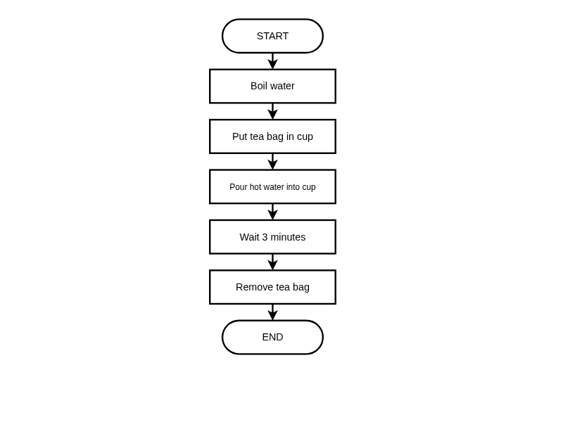

# What is an Algorithm?

**Description:** Define 'algorithm' and learn to visualize simple algorithms with flowcharts and pseudocode using procedural design principles.

**Duration:** 20-30 minutes  
**Learning Mode:** Read explanations, watch videos, complete exercises

---

## 📺 Watch: What is an Algorithm?

Watch this video introduction to algorithms before continuing with the lesson content.

**Video:** https://www.youtube.com/watch?v=xPvuJB33Fco

[](https://www.youtube.com/watch?v=xPvuJB33Fco)

## Learning Objectives
- Define "algorithm" and its key characteristics
- Understand **procedural algorithm design** principles
- Visualize algorithms with flowcharts
- Write algorithms in pseudocode
- Apply **decomposition** to break down problems

---

## What is an Algorithm?

**An algorithm is a finite, step-by-step procedure to solve a well-defined problem.**

Every algorithm has these **essential characteristics**:

1. **Input** — Data the algorithm receives (may be zero or more inputs)
2. **Output** — At least one result is produced
3. **Definiteness** — Each step is precisely defined with no ambiguity
4. **Finiteness** — The algorithm must terminate after a finite number of steps
5. **Effectiveness** — Each step must be basic enough to be carried out

### Algorithm vs Program
| Algorithm | Program |
|-----------|--------|
| Abstract solution | Concrete implementation |
| Language-independent | Written in a specific language |
| Focuses on logic | Includes syntax details |
| Design-level | Execution-level |

## 📺 Watch: Sequence in Algorithms

Watch this video to understand sequence - the foundation of all algorithms.

**Video:** https://www.youtube.com/watch?v=Clm4qow0xZo

[](https://www.youtube.com/watch?v=Clm4qow0xZo)

## Procedural Algorithm Design

**Procedural design** is an approach where we solve problems by defining a sequence of steps (procedures) that execute in order.

### The Three Pillars of Procedural Design:

**1. Sequence** — Steps execute one after another, top to bottom
```
Step 1 → Step 2 → Step 3 → Step 4
```

**2. Selection** — The algorithm chooses different paths based on conditions
```
IF condition is true THEN
    do this
ELSE
    do that
```

**3. Iteration** — Steps repeat while/until a condition is met
```
WHILE condition is true
    repeat these steps
```

> 💡 **Key Insight**: ANY algorithm can be built using just these three structures! This is called the **Structured Programming Theorem**.

## 🧪 Algorithm Characteristics

**Question:** Which of the following is NOT a required characteristic of an algorithm?

A) Finiteness — it must eventually stop
B) Efficiency — it must run as fast as possible
C) Definiteness — each step must be unambiguous
D) Output — it must produce at least one result

<details>
<summary><b>Show Answer</b></summary>

**Answer:** B

**Explanation:** While efficiency is desirable, it's not a required characteristic. An algorithm must be finite, definite, and produce output, but it doesn't have to be the fastest possible solution.

</details>


## Decomposition: Breaking Down Problems

**Decomposition** is the process of breaking a complex problem into smaller, manageable sub-problems.

### Example: Make Breakfast
Instead of one giant algorithm, decompose into sub-tasks:

```
Make Breakfast
├── Prepare Toast
│   ├── Get bread
│   ├── Put in toaster
│   └── Wait and remove
├── Cook Eggs
│   ├── Heat pan
│   ├── Crack eggs
│   └── Cook until done
└── Pour Drink
    ├── Get glass
    ├── Get juice from fridge
    └── Pour
```

### Benefits of Decomposition:
- **Simpler to understand** — small problems are easier to solve
- **Easier to test** — test each part separately
- **Reusable** — sub-algorithms can be used elsewhere
- **Collaborative** — different people can work on different parts

## 🧪 Procedural Design Principles

**Question:** According to the Structured Programming Theorem, which control structures are needed to create ANY algorithm?

A) Loops, functions, and classes
B) Sequence, selection, and iteration
C) Variables, arrays, and objects
D) Input, process, and output

<details>
<summary><b>Show Answer</b></summary>

**Answer:** B

**Explanation:** The Structured Programming Theorem states that any computable function can be implemented using only sequence (steps in order), selection (if-then-else), and iteration (loops).

</details>


## 🧪 When to Use Procedural Design

**Question:** Procedural algorithm design is MOST appropriate for which type of problem?

A) Modelling real-world entities with properties and behaviors
B) Step-by-step data processing with clear inputs and outputs
C) Building interactive user interfaces
D) Defining relationships between database tables

<details>
<summary><b>Show Answer</b></summary>

**Answer:** B

**Explanation:** Procedural design excels at step-by-step data processing problems (like calculations, file processing, data transformation). Object-oriented design is better for modelling entities, and other paradigms suit different problem types.

</details>


## Representing Algorithms

Algorithms can be represented in three ways:

- **Flowcharts** — Visual diagrams showing flow of control
- **Pseudocode** — Structured English following conventions
- **Code** — Actual programming language (like Python)

## Example Algorithm: Make a Cup of Tea

Let's look at a simple algorithm for making tea, shown as a flowchart:

## 📊 Make Tea Algorithm - Flowchart

_A simple sequential algorithm for making tea — using NESA HSC standard symbols_




## 📺 Watch: Pseudocode Explained

Watch this video introduction to pseudocode before learning about NESA pseudocode standards.

**Video:** https://www.youtube.com/watch?v=PbhfRF68GI4

[](https://www.youtube.com/watch?v=PbhfRF68GI4)

### The Same Algorithm in Pseudocode (NESA Standard)

Pseudocode is a way to write algorithms using structured English. Here's the tea algorithm:

```
BEGIN MakeTea
    BOIL water
    PLACE tea bag in cup
    POUR hot water into cup
    WAIT 3 minutes
    REMOVE tea bag
END MakeTea
```

**NESA Pseudocode Rules:**

- `BEGIN` and `END` mark the boundaries (with optional name)
- Keywords are in **UPPERCASE**
- Each step is an action verb
- Steps are in sequential order (top to bottom)
- Indent statements inside control structures

## Flowchart Symbols Reference (NESA HSC Standard)

When reading or creating flowcharts, use these standard symbols:

| Symbol | Shape | Purpose | Example |
|--------|-------|---------|--------|
| ⬭ | Rounded Rectangle (arcSize=50) | **Terminal** — Start or End of algorithm | START, END |
| ▭ | Rectangle | **Process** — an action or calculation | counter = counter + 1 |
| ◇ | Diamond (Rhombus) | **Decision** — a yes/no condition | x > 10? |
| ▱ | Parallelogram | **Input/Output** — receive or display data | INPUT name, OUTPUT result |
| ⧈ | Rectangle with bars | **Subroutine** — call to a predefined function | calculateTotal() |
| → | Arrow | **Flow Line** — direction of execution | (connects all shapes) |

**Important Rules:**

- Every flowchart must have exactly ONE START terminal
- Every flowchart must have at least ONE END terminal
- All shapes must be connected with flow lines
- Decision boxes must have exits labeled Yes/No or True/False

## 🧪 Quick Check: Flowchart Symbols

**Question:** Which flowchart symbol is used to represent a decision (yes/no question)?

A) Rectangle
B) Diamond
C) Ellipse
D) Parallelogram

<details>
<summary><b>Show Answer</b></summary>

**Answer:** B

**Explanation:** A diamond shape represents a decision point where the algorithm branches based on a condition (yes/no or true/false).

</details>


## 🧪 Understanding Algorithms

**Question:** What are the THREE essential components of every algorithm?

A) Input, Process, Output
B) Start, Steps, End
C) Variables, Loops, Conditions
D) Data, Functions, Classes

<details>
<summary><b>Show Answer</b></summary>

**Answer:** B

**Explanation:** Every algorithm must have a clear starting point, a sequence of steps to follow, and a defined ending point.

</details>


## Practice: Write Your Own Algorithm

Now it's your turn! Write a pseudocode algorithm for **"Brushing Your Teeth"**.

Think about:

- What's the first step?
- What actions do you perform?
- When does it end?

## ✍️ Exercise: Brushing Teeth Algorithm

Write a pseudocode algorithm for brushing your teeth. Use BEGIN and END to mark the boundaries, and include at least 5 steps. Remember: keywords in UPPERCASE!

**Starter Code:**
```
BEGIN BrushTeeth
    // Write your steps here
    
END BrushTeeth
```

**Hints:**
- Start with BEGIN and end with END
- Use action verbs in UPPERCASE (GET, APPLY, BRUSH, etc.)
- Think about what you physically do step by step
- Don't forget to clean up at the end!


```python
# Write your pseudocode here as Python comments
# Remember to use proper indentation and HSC conventions

"""
BEGIN BrushTeeth
    // Write your steps here
    
END BrushTeeth
"""

```

<details>
<summary><b>Example Answer</b></summary>

```
# Example solution
BEGIN BrushTeeth
    GET toothbrush and toothpaste
    APPLY toothpaste to brush
    WET the brush
    BRUSH teeth for 2 minutes
    SPIT out toothpaste
    RINSE mouth with water
    RINSE toothbrush
END BrushTeeth
```

</details>

## 📝 Reflection: Real-World Algorithms

Think of an everyday activity you do regularly (e.g., making breakfast, getting ready for school, playing a game). Describe it as a simple algorithm in 3-4 sentences. What is the starting point? What are the main steps? What marks the end?

<details>
<summary><b>Example Answer</b></summary>

Making my morning coffee is an algorithm. It starts when I wake up and decide I want coffee. The steps are: fill the kettle, boil water, add coffee to mug, pour water, add milk. It ends when I take my first sip.

</details>

## 🧪 Flowchart Symbol Check

**Question:** In the tea-making flowchart above, which symbol style is used for 'Boil water'?

A) Ellipse (oval) — because it's the start
B) Rectangle — because it's a process/action
C) Diamond — because it's a decision
D) Parallelogram — because it's an input

<details>
<summary><b>Show Answer</b></summary>

**Answer:** B

**Explanation:** 'Boil water' is an action or process, so it uses a rectangle. Rounded rectangles/ellipses are only used for START and END terminals.

</details>


## Abstraction in Algorithm Design

**Abstraction** means hiding unnecessary details and focusing on what's essential.

### Example: Driving a Car
You don't need to understand the engine's inner workings to drive. You just need to know:

- Accelerator makes it go
- Brake makes it stop
- Steering wheel changes direction

### In Algorithms:
```
// High abstraction (what, not how)
CALCULATE average of scores

// Lower abstraction (more detail)
SET total TO 0
FOR EACH score IN scores
    ADD score TO total
DIVIDE total BY count of scores
```

### Why Use Abstraction?
- **Focus on the problem**, not implementation details
- **Reduce complexity** — solve one level at a time
- **Create reusable solutions** — abstract functions work for many inputs

## 🧪 Understanding Abstraction

**Question:** You're designing an algorithm and write 'SORT the list'. This is an example of:

A) Decomposition — breaking into smaller parts
B) Abstraction — hiding the sorting details
C) Iteration — repeating the sort
D) Selection — choosing which items to sort

<details>
<summary><b>Show Answer</b></summary>

**Answer:** B

**Explanation:** Writing 'SORT the list' without specifying HOW to sort is abstraction. You're hiding the implementation details (bubble sort? merge sort?) and focusing on WHAT needs to happen.

</details>


## 🧪 Decomposition Practice

**Question:** You need to write an algorithm to 'Calculate student grades from test scores'. Which decomposition makes the most sense?

A) Split by student name: A-M students, N-Z students
B) Split by steps: Input scores → Calculate average → Determine grade → Output result
C) Split by difficulty: Easy calculations, Hard calculations
D) No decomposition needed — it's simple enough

<details>
<summary><b>Show Answer</b></summary>

**Answer:** B

**Explanation:** Decomposing by the logical steps of the process (input, process, output) creates clear, reusable sub-tasks. Splitting by name would duplicate logic unnecessarily.

</details>


## 🧪 Algorithm Design Thinking

**Question:** Before writing any code or pseudocode, what should you do FIRST when given a problem?

A) Start typing code immediately to save time
B) Look up a solution on the internet
C) Understand the problem: identify inputs, outputs, and constraints
D) Choose which programming language to use

<details>
<summary><b>Show Answer</b></summary>

**Answer:** C

**Explanation:** Understanding the problem is the essential first step. You need to know what inputs you have, what outputs are expected, and any constraints or special cases before designing a solution.

</details>


## 📝 Design Thinking: Problem Analysis

Consider this problem: 'Create an algorithm to find the oldest person in a group.'

Before writing any solution, analyze the problem:
1. What are the inputs?
2. What is the expected output?
3. What steps would you need (use decomposition)?
4. Are there any edge cases to consider?

<details>
<summary><b>Example Answer</b></summary>

Inputs: A list of people with their ages (or birth dates). Output: The name of the oldest person (or their details). Steps: (1) Get the list of people and ages, (2) Compare ages to find the maximum, (3) Return the person with the maximum age. Edge cases: What if two people have the same age? What if the list is empty? What if there's only one person? The algorithm should handle these scenarios.

</details>

## Summary: The Algorithm Design Process

1. **Understand** — What is the problem? What are inputs/outputs?
2. **Decompose** — Break the problem into smaller sub-problems
3. **Abstract** — Focus on what, not how, for complex parts
4. **Design** — Create the algorithm using sequence, selection, iteration
5. **Represent** — Express it as flowchart, pseudocode, then code
6. **Verify** — Test with different inputs including edge cases

> 🧠 **Algorithmic Thinking** is this problem-solving approach — it works for any problem, not just programming!

## ✅ Lesson Complete!

You've completed this lesson. Make sure you:

- ✓ Watched all videos
- ✓ Read all explanations
- ✓ Completed all exercises
- ✓ Answered all quiz questions

**Ready for the next lesson?** Continue to the next notebook!
