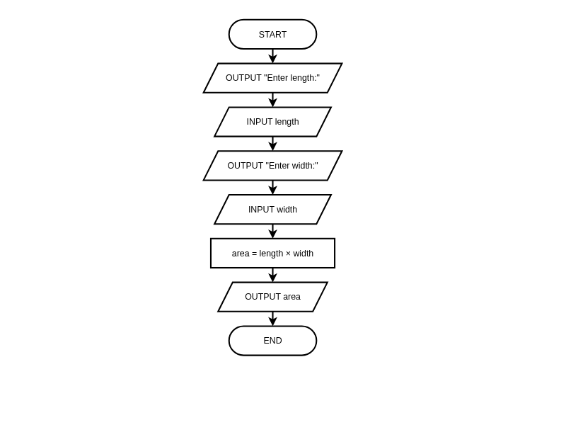

# Variables and Input/Output

**Description:** Learn to store data in variables, understand the IPO model, and design algorithms that interact with users using flowcharts and pseudocode.

**Duration:** 20-30 minutes  
**Learning Mode:** Read explanations, watch videos, complete exercises

---

## 📺 Watch: Variables and Input/Output

Watch this video introduction to variables and input/output before continuing with the lesson content.

**Video:** https://www.youtube.com/watch?v=XcC3CY-Yexs

[](https://www.youtube.com/watch?v=XcC3CY-Yexs)

# Variables and Input/Output

## Learning Objectives
- Understand what variables are and how to use them
- Apply the **IPO (Input-Process-Output) model** to algorithm design
- Use **flowchart symbols** for input and output operations
- Write **pseudocode** following HSC conventions
- Design algorithms with clear **data flow**

---

## The IPO Model: Algorithm Foundation

Almost every algorithm follows the **IPO model**:

```
┌─────────┐    ┌─────────────┐    ┌─────────┐
│  INPUT  │ →  │   PROCESS   │ →  │ OUTPUT  │
└─────────┘    └─────────────┘    └─────────┘
```

| Stage | Description | Examples |
|-------|-------------|----------|
| **Input** | Data coming into the algorithm | User typing, file reading, sensor data |
| **Process** | Calculations and transformations | Calculations, comparisons, sorting |
| **Output** | Results going out | Screen display, file writing, sending data |

### Designing with IPO in Mind
When given a problem, ask yourself:

1. **What inputs do I need?** (What data is provided?)
2. **What processing must happen?** (What transformations?)
3. **What output is expected?** (What result should appear?)

## 🧪 Understanding IPO

**Question:** In an algorithm that calculates the area of a rectangle, which represents the INPUT?

A) The area value calculated
B) The length and width values
C) The multiplication operation
D) The print statement

<details>
<summary><b>Show Answer</b></summary>

**Answer:** B

**Explanation:** The INPUT is the data that enters the algorithm — in this case, the length and width. The multiplication is PROCESS, and printing the area is OUTPUT.

</details>


## What is a Variable?

**A variable is a named storage location that holds data during algorithm execution.**

Think of it like a labeled box:

- The **name** identifies what's inside
- The **value** is what's actually stored
- You can **change** the value at any time

```
┌─────────────┐
│   "Alice"   │  ← value
├─────────────┤
│    name     │  ← variable name
└─────────────┘
```

### Variable Naming Best Practices
| Good Names | Bad Names | Why |
|------------|-----------|-----|
| `studentAge` | `a` | Descriptive vs cryptic |
| `totalScore` | `x123` | Meaningful vs random |
| `isValid` | `flag` | Intent clear vs vague |

## 🧪 Quick Check: Variables

**Question:** In the pseudocode `score = 85`, what is `score`?

A) A number
B) A variable name
C) An output command
D) A string

<details>
<summary><b>Show Answer</b></summary>

**Answer:** B

**Explanation:** `score` is the variable name — it's the label for the storage location that holds the value 85.

</details>


## Input and Output in Pseudocode (HSC Standard)

**Input** — Receiving data from outside (usually from a user typing)

**Output** — Displaying results (usually on screen)

### HSC Pseudocode Keywords:

| Keyword | Purpose | Example |
|---------|---------|--------|
| `INPUT` | Get data from user | `INPUT name` |
| `OUTPUT` | Display a result | `OUTPUT total` |
| `DISPLAY` | Show a message | `DISPLAY "Hello"` |

### Assignment (Setting Variable Values):

In HSC pseudocode, you can assign values to variables in two ways:

```
SET age TO 25          // Using SET ... TO
age = 25               // Using equals sign
```

**Both forms are acceptable.** Use whichever is clearer for your algorithm.

### Example Algorithm:
```
BEGIN GreetUser
    OUTPUT "What is your name?"
    INPUT name
    SET greeting TO "Hello, " + name + "!"
    OUTPUT greeting
END GreetUser
```

### String Concatenation (Joining Text)

The `+` symbol can join text together. This is called **concatenation**:

```
SET firstName TO "John"
SET lastName TO "Smith"
SET fullName TO firstName + " " + lastName
// fullName now contains "John Smith"
```

When you write `"Hello, " + name`, you're joining the text "Hello, " with whatever value is stored in `name`.

## 📊 Input/Output Flowchart: Calculate Rectangle Area

_A sequential algorithm demonstrating INPUT (parallelogram), PROCESS (rectangle), and OUTPUT (parallelogram) — NESA HSC standard symbols_




## Flowchart Symbols for I/O

Notice in the flowchart above:

| Shape | Symbol | Purpose |
|-------|--------|--------|
| **Parallelogram** ▱ | Input/Output | Used for both INPUT and OUTPUT operations |
| **Rectangle** ▭ | Process | Used for calculations and assignments |
| **Rounded Rectangle** ⬭ | Terminal | START and END only |

### Key Points:
- The **parallelogram** is used for ALL data input and output operations
- Prompts ("Enter length:") are OUTPUT operations
- Getting user data (`INPUT length`) is an INPUT operation
- Calculations (`area = length × width`) are PROCESS operations

## 🧪 Flowchart Symbol Check

**Question:** Which flowchart shape should you use for 'INPUT score'?

A) Rectangle — because it's an action
B) Diamond — because it's a decision
C) Parallelogram — because it's an input/output operation
D) Rounded rectangle — because it's a start/end

<details>
<summary><b>Show Answer</b></summary>

**Answer:** C

**Explanation:** The parallelogram shape is used for all input and output operations. This includes INPUT, OUTPUT, DISPLAY, READ, and WRITE operations.

</details>


## ✍️ Practice: Pseudocode for Calculator

Write pseudocode for a simple calculator that:
1. Gets two numbers from the user
2. Calculates and displays the sum, difference, and product

Remember to use OUTPUT for prompts, INPUT to get values, and SET...TO or = for calculations.

**Starter Code:**
```
BEGIN SimpleCalculator
    // Get the two numbers
    
    // Calculate results
    
    // Display results
    
END SimpleCalculator
```

**Hints:**
- Use OUTPUT to display prompts to the user
- Use INPUT to get values from the user
- Use SET ... TO or = for calculations
- Remember to OUTPUT all three results


```python
# Write your pseudocode here as Python comments
# Remember to use proper indentation and HSC conventions

"""
BEGIN SimpleCalculator
    // Get the two numbers
    
    // Calculate results
    
    // Display results
    
END SimpleCalculator
"""

```

<details>
<summary><b>Example Answer</b></summary>

```
# Example solution
BEGIN SimpleCalculator
    OUTPUT "Enter first number:"
    INPUT num1
    OUTPUT "Enter second number:"
    INPUT num2
    
    SET sum TO num1 + num2
    SET difference TO num1 - num2
    SET product TO num1 * num2
    
    OUTPUT "Sum: " + sum
    OUTPUT "Difference: " + difference
    OUTPUT "Product: " + product
END SimpleCalculator
```

</details>

## 🧪 Algorithm Design: Data Flow

**Question:** When designing an algorithm, why is it important to identify ALL variables before writing code?

A) To make the code run faster
B) To know what data will flow through the algorithm and how it transforms
C) Variables aren't important — you can add them later
D) Only input variables matter

<details>
<summary><b>Show Answer</b></summary>

**Answer:** B

**Explanation:** Identifying variables helps you understand the data flow: what comes in, what intermediate values are needed, and what goes out. This is part of algorithmic thinking — planning before coding.

</details>


## Trace Tables: Tracking Data Flow

A **trace table** is a tool for tracking how variable values change during algorithm execution.

### Example: Calculate Total Price
```
quantity = 3
price = 10
total = quantity * price
tax = total * 0.1
final = total + tax
```

| Step | quantity | price | total | tax | final |
|------|----------|-------|-------|-----|-------|
| 1 | 3 | — | — | — | — |
| 2 | 3 | 10 | — | — | — |
| 3 | 3 | 10 | 30 | — | — |
| 4 | 3 | 10 | 30 | 3 | — |
| 5 | 3 | 10 | 30 | 3 | 33 |

### Why Use Trace Tables?
- **Debug** — Find where values go wrong
- **Verify** — Confirm algorithm correctness
- **Understand** — See data flow step by step

## 🧪 Trace Table Skill

**Question:** Given this algorithm, what is the final value of `result`?
```
a = 5
b = 3
result = a + b
a = 10
result = result + a
```

A) 8
B) 18
C) 13
D) 15

<details>
<summary><b>Show Answer</b></summary>

**Answer:** B

**Explanation:** Trace through: a=5, b=3, result=5+3=8, a=10, result=8+10=18. The key insight is that changing 'a' later doesn't affect the first calculation.

</details>


## Designing Input-Output Algorithms

### Algorithm Design Checklist:

1. **Identify all inputs** — What data does the user/system provide?
2. **Identify all outputs** — What results must be displayed/returned?
3. **Identify intermediate variables** — What values are needed during processing?
4. **Define the processing steps** — How do inputs become outputs?
5. **Consider edge cases** — What if input is zero? Empty? Negative?

### Example Design: Age Calculator

**Problem:** Calculate how old someone will be in a future year.

| Element | Value |
|---------|-------|
| Inputs | `birthYear`, `futureYear` |
| Outputs | `futureAge` |
| Processing | `futureAge = futureYear - birthYear` |
| Edge case | What if futureYear < birthYear? (negative age!) |

## 🧪 IPO Design Practice

**Question:** For an algorithm that converts temperature from Celsius to Fahrenheit, identify the correct IPO breakdown:

A) Input: Fahrenheit, Process: Subtract 32, Output: Celsius
B) Input: Celsius, Process: Multiply by 9/5 and add 32, Output: Fahrenheit
C) Input: Temperature, Process: Convert, Output: Temperature
D) Input: Formula, Process: Apply, Output: Result

<details>
<summary><b>Show Answer</b></summary>

**Answer:** B

**Explanation:** The input is the Celsius value, the process is applying the formula (C × 9/5 + 32), and the output is the Fahrenheit result. Option C is too vague — good algorithm design requires specificity.

</details>


## 🧪 Algorithm Design Thinking

**Question:** When designing an algorithm to calculate average test scores, which of these is an 'intermediate variable'?

A) The list of test scores (input)
B) The average result (output)
C) The running total of scores (processing)
D) The print statement

<details>
<summary><b>Show Answer</b></summary>

**Answer:** C

**Explanation:** The running total is an intermediate variable — it's not input or output, but it's needed during processing to calculate the final average. Identifying these helps plan your algorithm.

</details>


## 📝 Reflection: Variables in Real Programs

Think about a mobile app or game you use. What information might it store in variables? List at least 3 examples and explain what type of data each would hold (text/string, number, etc.).

<details>
<summary><b>Example Answer</b></summary>

In a game like Minecraft, variables might store: 1) The player's health as a number (e.g., health = 20). 2) The player's username as text/string (e.g., username = "Steve"). 3) The player's inventory count as a number (e.g., diamonds = 5). 4) Whether the player is in creative mode as true/false (e.g., creative_mode = True).

</details>

---

## Implementing in Python

Now that you understand the concepts in pseudocode and flowcharts, here's how to implement input/output in Python:

### Pseudocode vs Python Comparison:

| Pseudocode | Python | Purpose |
|------------|--------|--------|
| `INPUT name` | `name = input()` | Get user input |
| `OUTPUT result` | `print(result)` | Display output |
| `SET x TO 5` | `x = 5` | Assign value |
| `"Hello, " + name` | `"Hello, " + name` | Concatenation (same!) |

### Working with Numbers in Python

When you get input from a user in Python, it's always **text** (a string). To do maths, you need to convert it:

```python
age_text = input("Enter your age: ")   # This is text: "25"
age = int(age_text)                     # Convert to number: 25
next_year = age + 1                     # Now maths works!
print("Next year you will be", next_year)
```

Or combine it in one line:
```python
age = int(input("Enter your age: "))
```

## 🐍 Practice: Your First Input/Output Program

Write a Python program that:
1. Asks the user for their favourite colour
2. Creates a message saying "Your favourite colour is [colour]!"
3. Prints the message

Use the `input()` function to get user input and `print()` to display output. Use `+` to join strings together (concatenation).

**Hints:**
- Use input() with a prompt message to ask the user
- Store the user's answer in a variable
- Use + to join strings together (concatenation)
- Use print() to display the final message


```python
# Ask for the user's favourite colour

# Create a message using concatenation (+)

# Print the message

```

<details>
<summary><b>Example Solution</b></summary>

```
# Example solution
# Ask for the user's favourite colour
colour = input("What is your favourite colour? ")

# Create a message using concatenation (+)
message = "Your favourite colour is " + colour + "!"

# Print the message
print(message)
```

</details>

## 🧪 Understanding Type Conversion

**Question:** What will happen if you run: `result = "5" + "3"`?

A) result will be 8 (a number)
B) result will be "53" (a string)
C) Python will show an error
D) result will be 15

<details>
<summary><b>Show Answer</b></summary>

**Answer:** B

**Explanation:** When you use + with strings, Python concatenates (joins) them. "5" + "3" = "53". To add numbers, you need: int("5") + int("3") = 8

</details>


## ✅ Lesson Complete!

You've completed this lesson. Make sure you:

- ✓ Watched all videos
- ✓ Read all explanations
- ✓ Completed all exercises
- ✓ Answered all quiz questions

**Ready for the next lesson?** Continue to the next notebook!
