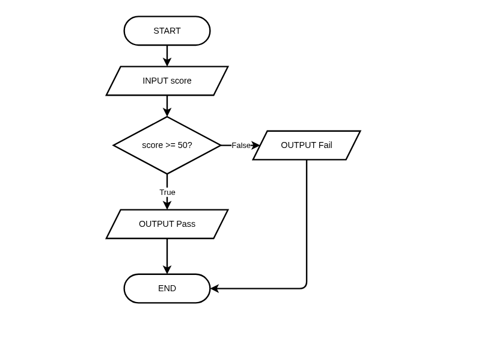
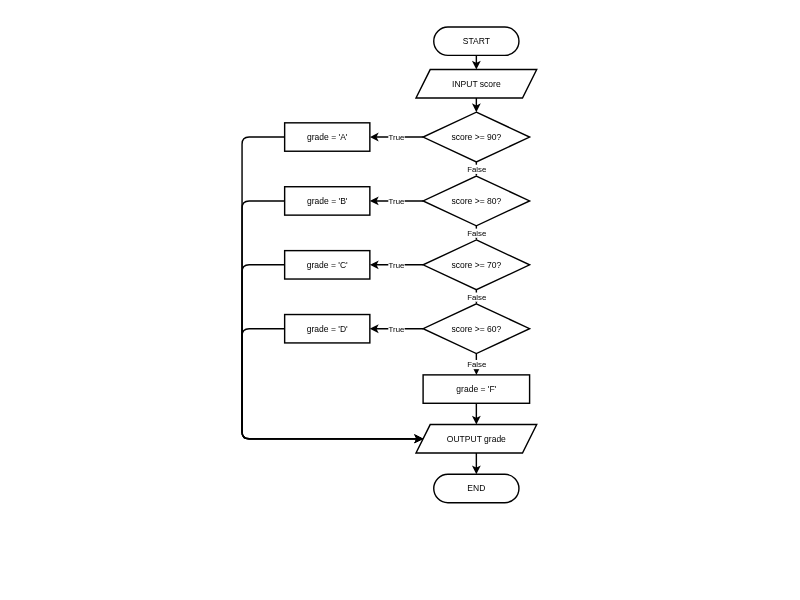
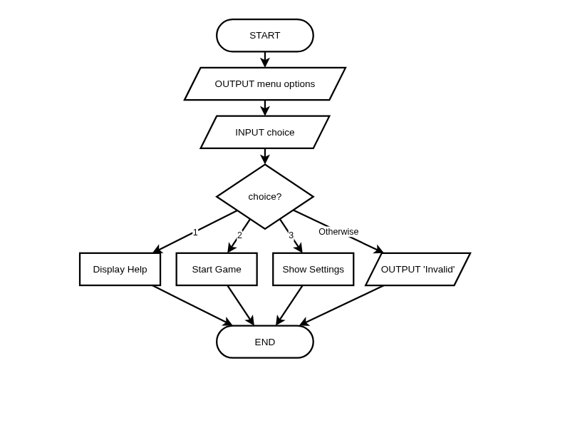

# Selection (If-Then-Else)

**Description:** Learn to design algorithms with conditional logic using flowcharts and pseudocode, and master decision-making structures.

**Duration:** 20-30 minutes  
**Learning Mode:** Read explanations, watch videos, complete exercises

---

## 📺 Watch: Binary Selection (If-Then-Else)

Watch this video to understand binary selection (if-then-else) before continuing with the lesson.

**Video:** https://www.youtube.com/watch?v=jf2P5aF6PxI

[](https://www.youtube.com/watch?v=jf2P5aF6PxI)

## 📺 Watch: Multiway Selection

Watch this video to understand multiway selection (if-elseif-else) structures.

**Video:** https://www.youtube.com/watch?v=gVtntHa80rU

[](https://www.youtube.com/watch?v=gVtntHa80rU)

# Selection (If-Then-Else)

## Learning Objectives
- Understand **selection** as a fundamental control structure
- Design algorithms with **decision points** using flowcharts
- Use IF/ELSE and IF/ELSEIF/ELSE in pseudocode
- Apply **boolean logic** to conditions
- Choose the right selection structure for a problem

---

## What is Selection?

**Selection** allows an algorithm to choose different paths based on conditions.

Without selection, algorithms would be linear — doing the same thing every time. Selection gives algorithms **intelligence** to respond to different situations.

### When to Use Selection:
- Categorizing data (grade letters, age groups)
- Validating input (is the value acceptable?)
- Handling special cases (divide by zero, empty lists)
- Making decisions (should we continue or stop?)

## 🧪 Recognizing Selection Problems

**Question:** Which problem requires selection (branching) in its algorithm?

A) Calculate the sum of 10 numbers
B) Print each item in a list
C) Determine if a number is positive, negative, or zero
D) Repeat a message 5 times

<details>
<summary><b>Show Answer</b></summary>

**Answer:** C

**Explanation:** Determining if a number is positive, negative, or zero requires checking conditions and branching to different outputs. The other problems are sequential (sum), iteration (print each, repeat), not selection.

</details>


## Binary Selection Flowchart (HSC Standard)

**Binary selection** has exactly **two paths**: one for when the condition is TRUE, and one for when it's FALSE.

### Key Flowchart Rules:
- Use a **diamond (rhombus)** shape for decisions
- Label the two exits **True** and **False** (or Yes/No)
- Both paths must **merge back** to a single flow line

## 📊 Binary Selection Flowchart: Pass or Fail

_Binary Selection (IF-THEN-ELSE): Decision diamond has exactly two exits labeled True/False. True flows down, False branches right. Both paths merge at END — NESA HSC standard_



_Click the diagram to open in full editor_


## Writing Selection in Pseudocode (HSC Standard)

```
BEGIN PassFail
    INPUT score
    IF score >= 50 THEN
        OUTPUT "Pass"
    ELSE
        OUTPUT "Fail"
    ENDIF
END PassFail
```

### Key Elements:
- `IF condition THEN` — starts the selection
- `ELSE` — what happens if condition is false (optional)
- `ENDIF` — marks the end of the selection block (required!)

## 🧪 Quick Check: Selection Syntax

**Question:** In pseudocode, what keyword ends an IF statement?

A) END
B) ENDIF
C) ELSE
D) STOP

<details>
<summary><b>Show Answer</b></summary>

**Answer:** B

**Explanation:** In pseudocode, IF statements end with ENDIF. This clearly marks where the conditional block finishes.

</details>


## Boolean Logic in Conditions

**Boolean expressions** evaluate to either TRUE or FALSE. They control which branch executes.

### Comparison Operators:
| Operator | Meaning | Example | Result |
|----------|---------|---------|--------|
| `=` | Equal to | `5 = 5` | TRUE |
| `<>` | Not equal | `5 <> 3` | TRUE |
| `<` | Less than | `3 < 5` | TRUE |
| `>` | Greater than | `5 > 3` | TRUE |
| `<=` | Less than or equal | `5 <= 5` | TRUE |
| `>=` | Greater than or equal | `6 >= 5` | TRUE |

### Logical Operators (Combining Conditions):
| Operator | Meaning | Example | Result |
|----------|---------|---------|--------|
| `AND` | Both must be true | `(5 > 3) AND (10 > 8)` | TRUE |
| `OR` | At least one true | `(5 > 3) OR (2 > 8)` | TRUE |
| `NOT` | Reverses true/false | `NOT (5 > 10)` | TRUE |

## 🧪 Boolean Logic Practice

**Question:** If `age = 17` and `hasLicense = TRUE`, what is the result of: `(age >= 18) AND hasLicense`?

A) TRUE — because hasLicense is TRUE
B) FALSE — because age >= 18 is FALSE
C) TRUE — because one condition is TRUE
D) Error — you can't combine these conditions

<details>
<summary><b>Show Answer</b></summary>

**Answer:** B

**Explanation:** AND requires BOTH conditions to be TRUE. Since age >= 18 is FALSE (17 is not >= 18), the whole expression is FALSE regardless of hasLicense.

</details>


## 🧪 Choosing AND vs OR

**Question:** You're designing a login algorithm. A user can access the system if they have a valid password OR if they're an admin. Which condition is correct?

A) validPassword AND isAdmin
B) validPassword OR isAdmin
C) validPassword = isAdmin
D) NOT validPassword AND NOT isAdmin

<details>
<summary><b>Show Answer</b></summary>

**Answer:** B

**Explanation:** The word 'or' in the requirement means EITHER condition grants access. Use OR when any single condition is sufficient. Use AND when all conditions must be met.

</details>


## Multiway Selection (IF-ELSEIF-ELSE)

Sometimes you need more than two branches. Use `ELSEIF` (else if):

```
IF score >= 85 THEN
    OUTPUT "High Distinction"
ELSEIF score >= 75 THEN
    OUTPUT "Distinction"
ELSEIF score >= 50 THEN
    OUTPUT "Pass"
ELSE
    OUTPUT "Fail"
ENDIF
```

### Key Points:
- Conditions are checked **in order** from top to bottom
- The **first true condition** executes, then the algorithm skips to ENDIF
- `ELSE` catches **all remaining cases**
- There is still only **one ENDIF** at the end

## 📊 Multiway Selection Flowchart: Grade Categories

_Multiway Selection (IF-ELSEIF-ELSE): Chain of decisions where only ONE path executes. False leads to next check, all paths merge at the end — NESA HSC standard_



_Click the diagram to open in full editor_


## ✍️ Practice: Grade Calculator

Write pseudocode that converts a numeric score to a letter grade:
- 90 or above: "A"
- 80-89: "B"
- 70-79: "C"
- 60-69: "D"
- Below 60: "F"

Remember to check conditions from **highest to lowest** so more specific conditions are checked first.

**Starter Code:**
```
BEGIN GradeCalculator
    OUTPUT "Enter score:"
    INPUT score
    
    // Determine the grade using IF-ELSEIF-ELSE
    
    OUTPUT grade
END GradeCalculator
```

**Hints:**
- Start with the highest grade (90+) and work down
- Use ELSEIF for each additional condition
- The ELSE catches everything below 60
- Don't forget ENDIF at the end


```python
# Write your pseudocode here as Python comments
# Remember to use proper indentation and HSC conventions

"""
BEGIN GradeCalculator
    OUTPUT "Enter score:"
    INPUT score
    
    // Determine the grade using IF-ELSEIF-ELSE
    
    OUTPUT grade
END GradeCalculator
"""

```

**Example Answer:**


```python
# Example solution
BEGIN GradeCalculator
    OUTPUT "Enter score:"
    INPUT score
    
    IF score >= 90 THEN
        SET grade TO "A"
    ELSEIF score >= 80 THEN
        SET grade TO "B"
    ELSEIF score >= 70 THEN
        SET grade TO "C"
    ELSEIF score >= 60 THEN
        SET grade TO "D"
    ELSE
        SET grade TO "F"
    ENDIF
    
    OUTPUT grade
END GradeCalculator
```

## ✍️ Practice: Temperature Checker

Write pseudocode that:
1. Gets a temperature from the user
2. If temperature >= 30, output "Hot"
3. If temperature >= 20 but less than 30, output "Warm"
4. If temperature >= 10 but less than 20, output "Cool"
5. Otherwise, output "Cold"

**Starter Code:**
```
BEGIN TemperatureChecker
    
END TemperatureChecker
```

**Hints:**
- Use ELSEIF for multiple conditions
- Check from highest to lowest temperature
- Don't forget ENDIF at the end


```python
# Write your pseudocode here as Python comments
# Remember to use proper indentation and HSC conventions

"""
BEGIN TemperatureChecker
    
END TemperatureChecker
"""

```

**Example Answer:**


```python
# Example solution
BEGIN TemperatureChecker
    OUTPUT "Enter temperature:"
    INPUT temp
    
    IF temp >= 30 THEN
        OUTPUT "Hot"
    ELSEIF temp >= 20 THEN
        OUTPUT "Warm"
    ELSEIF temp >= 10 THEN
        OUTPUT "Cool"
    ELSE
        OUTPUT "Cold"
    ENDIF
END TemperatureChecker
```

## CASEWHERE Selection

When you're checking a single variable against **exact values** (not ranges), use `CASEWHERE`:

```
CASEWHERE dayNumber
    1: dayName = "Monday"
    2: dayName = "Tuesday"
    3: dayName = "Wednesday"
    4: dayName = "Thursday"
    5: dayName = "Friday"
    OTHERWISE: dayName = "Weekend"
ENDCASE
```

### When to Use CASEWHERE vs IF-ELSEIF:
| Use CASEWHERE when... | Use IF-ELSEIF when... |
|----------------------|----------------------|
| Checking **exact values** | Checking **ranges** |
| Menu options (1, 2, 3, 4) | Score >= 90 |
| Day of week (Mon, Tue...) | Temperature >= 30 |
| Single variable | Multiple variables |

## 📊 CASEWHERE Flowchart: Menu Selection

_CASEWHERE Flowchart: Multiple branches from one decision, each labeled with its value. OTHERWISE handles unmatched cases — NESA HSC standard_



_Click the diagram to open in full editor_


## 🧪 Selecting the Right Structure

**Question:** You need to categorize ages: Child (0-12), Teen (13-17), Adult (18-64), Senior (65+). Which structure is most appropriate?

A) Simple IF-THEN
B) IF-THEN-ELSE
C) IF-ELSEIF-ELSE chain
D) CASEWHERE

<details>
<summary><b>Show Answer</b></summary>

**Answer:** C

**Explanation:** Age categories are RANGES, not exact values, so CASEWHERE won't work. We need to check multiple conditions in sequence, making IF-ELSEIF-ELSE the right choice.

</details>


## 🧪 Algorithm Design: Edge Cases

**Question:** Your algorithm divides a number by user input. What edge case MUST your selection handle?

A) User enters a very large number
B) User enters a negative number
C) User enters zero (division by zero)
D) User enters a decimal number

<details>
<summary><b>Show Answer</b></summary>

**Answer:** C

**Explanation:** Division by zero causes an error and must be handled with selection: IF divisor = 0 THEN handle error ELSE perform division. This is a critical edge case in algorithm design.

</details>


## Nested Selection: Decisions within Decisions

Sometimes you need to make a decision based on the outcome of another decision.

```
IF hasTicket THEN
    IF age >= 18 THEN
        OUTPUT "Welcome to the adult section"
    ELSE
        OUTPUT "Welcome to the family section"
    ENDIF
ELSE
    OUTPUT "Please purchase a ticket first"
ENDIF
```

### Design Tip:
- Keep nesting to a maximum of 2-3 levels for readability
- Consider using ELSEIF chains as an alternative
- Complex nested logic may indicate you need to decompose the problem

## 📝 Reflection: Selection in Everyday Life

Describe a real-life situation where you make a decision based on a condition. Write it as an IF-THEN-ELSE statement in plain English. Then identify: Is it binary selection, multi-way selection, or nested selection?

**Example Answer:**

When I'm deciding what to wear: IF the temperature is below 15 degrees THEN I wear a jacket and long pants ELSEIF it's below 25 degrees THEN I wear a light sweater ELSE I wear a t-shirt and shorts. This is a multi-way selection (IF-ELSEIF-ELSE) because there are more than two possible outcomes based on ranges of temperature.


## 🧪 Condition Order Matters

**Question:** What's wrong with this algorithm?
```
IF score >= 50 THEN grade = "Pass"
ELSEIF score >= 80 THEN grade = "High Distinction"
ENDIF
```

A) Nothing — it works correctly
B) The ELSEIF will never execute for scores >= 80
C) It needs an ELSE clause
D) The syntax is incorrect

<details>
<summary><b>Show Answer</b></summary>

**Answer:** B

**Explanation:** A score of 85 would match the FIRST condition (85 >= 50), so it gets "Pass" and the second check never runs. Always check for the more SPECIFIC/restrictive conditions FIRST.

</details>


---

## Implementing Selection in Python

Now that you understand selection in pseudocode and flowcharts, here's how it works in Python:

### Pseudocode vs Python Comparison:

| Pseudocode | Python |
|------------|--------|
| `IF condition THEN` | `if condition:` |
| `ELSEIF condition THEN` | `elif condition:` |
| `ELSE` | `else:` |
| `ENDIF` | (indentation ends the block) |

### Key Python Differences:
- Uses `:` instead of `THEN`
- Uses `elif` instead of `ELSEIF`
- **Indentation** (spaces) shows what's inside the if/else
- No `ENDIF` needed — Python uses indentation to end blocks

## 🐍 Practice: Age Checker

Write a Python program that:
1. Asks the user for their age
2. If they are 18 or older, print "You are an adult"
3. Otherwise, print "You are a minor"

**Remember:** `input()` returns a string, so you need to convert it to an integer using `int()` before comparing numbers. For example: `age = int(input("Enter age: "))`

This demonstrates binary selection (IF-THEN-ELSE) in Python.

**Hints:**
- input() always returns a string - use int(input(...)) to convert it to a number for comparisons
- The condition is: age >= 18
- Remember the colon : after if and else
- Indent the code inside if/else with 4 spaces


```python
# Get the user's age (remember: input() returns a string!)

# Check if adult or minor

```

**Example Solution:**


```python
# Example solution
# Get the user's age
age = int(input("Enter your age: "))

# Check if adult or minor
if age >= 18:
    print("You are an adult")
else:
    print("You are a minor")
```

## ✅ Lesson Complete!

You've completed this lesson. Make sure you:

- ✓ Watched all videos
- ✓ Read all explanations
- ✓ Completed all exercises
- ✓ Answered all quiz questions

**Ready for the next lesson?** Continue to the next notebook!
