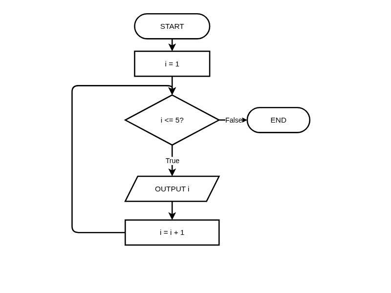
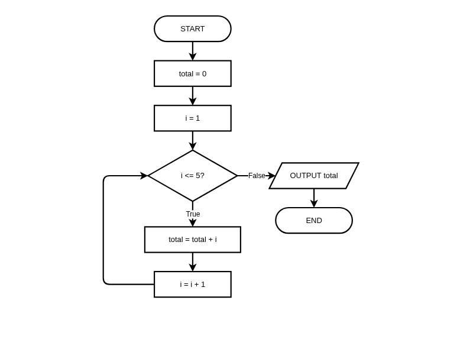

# Counting and Accumulating Loops (FOR)

**Description:** Learn to design algorithms with definite iteration using FOR loops in flowcharts and pseudocode, and master the counting and accumulating patterns.

**Duration:** 20-30 minutes  
**Learning Mode:** Read explanations, watch videos, complete exercises

---

## 📺 Watch: Pre-test Iteration

Watch this video to understand pre-test iteration (FOR loops) before continuing with the lesson.

**Video:** https://www.youtube.com/watch?v=AgxHcDRDvCs

[](https://www.youtube.com/watch?v=AgxHcDRDvCs)

## 📺 Watch: Sequence, Selection & Iteration

This video reviews all three control structures and how they work together.

**Video:** https://www.youtube.com/watch?v=Yw2Rxa6gfVg

[](https://www.youtube.com/watch?v=Yw2Rxa6gfVg)

# Counting and Accumulating Loops (FOR)

## Learning Objectives
- Understand **iteration** as a fundamental control structure
- Design FOR loops in **flowcharts** (counted loop structure)
- Write FOR loops in **pseudocode** using HSC standard syntax
- Apply the **counting** and **accumulator** patterns
- Trace through loop execution step by step

---

## Iteration: The Power of Repetition

**Iteration** (also called repetition or looping) allows algorithms to repeat steps without writing them multiple times.

### Why Loops Matter:
- Process **collections** of data (lists, files)
- Repeat until a **goal** is reached
- Automate **repetitive** tasks
- Essential for **scalable** algorithms

### Recognizing Iteration Problems:
| Problem Statement | Iteration Needed? |
|-------------------|------------------|
| "For each student..." | ✓ Yes |
| "Repeat 10 times..." | ✓ Yes |
| "Process all items..." | ✓ Yes |
| "Calculate the sum of..." | ✓ Yes (accumulator) |
| "Check if password matches..." | ✗ No (selection) |

## 🧪 Recognizing Iteration Problems

**Question:** Which problem clearly requires iteration in its solution?

A) Determine if a number is even or odd
B) Find the largest of three numbers
C) Print all numbers from 1 to 100
D) Calculate the area of a rectangle

<details>
<summary><b>Show Answer</b></summary>

**Answer:** C

**Explanation:** Printing numbers 1 to 100 requires repeating the print operation 100 times — that's iteration. The others are single calculations (selection or sequence).

</details>


## FOR Loop Flowchart (HSC Standard)

A **FOR loop** (counted loop) repeats a block of code a **known number of times**.

In flowcharts, counted loops use a **special structure** that shows:

- The **initialization** of the loop counter
- The **condition** to continue looping
- The **increment** of the counter

### Key Flowchart Elements:
- **Preparation symbol** (hexagon) shows the loop setup: variable, start, end, and step
- **Decision diamond** checks if the counter is within range
- **Process rectangle** for the loop body
- **Flow arrows** show the loop back to the condition

## 📊 FOR Loop Flowchart: Print Numbers 1 to 5

_FOR Loop (Counted Loop): Initialize counter → Check condition → Execute body → Increment → Loop back. Exits when condition is False — NESA HSC standard_



_Click the diagram to open in full editor_


## FOR Loop Pseudocode (HSC Standard)

In NESA HSC pseudocode, the FOR loop has this structure:

```
FOR counter = start TO end STEP increment
    // loop body (actions to repeat)
NEXT counter
```

### Key Points:
- `FOR counter = start TO end` sets the range
- `STEP increment` specifies how much to add each iteration (default is 1)
- `NEXT counter` marks the end of the loop and increments
- The range is **inclusive** (includes both start and end values)

### Example: Print 1 to 5
```
BEGIN PrintNumbers
    FOR i = 1 TO 5 STEP 1
        OUTPUT i
    NEXT i
END PrintNumbers
```

This outputs: 1, 2, 3, 4, 5

### Example: Count by 2s
```
BEGIN CountByTwos
    FOR i = 2 TO 10 STEP 2
        OUTPUT i
    NEXT i
END CountByTwos
```

This outputs: 2, 4, 6, 8, 10

## 🧪 Loop Design: Definite vs Indefinite

**Question:** FOR loops are called 'definite iteration' because:

A) They always produce correct results
B) The number of iterations is known before the loop starts
C) They can only loop a maximum of 100 times
D) They must contain exactly one statement

<details>
<summary><b>Show Answer</b></summary>

**Answer:** B

**Explanation:** FOR loops are 'definite' because you know exactly how many times they'll run before they start. WHILE loops are 'indefinite' because the count depends on conditions evaluated during execution.

</details>


## 🧪 Quick Check: FOR Loop Syntax

**Question:** What values does `FOR i = 1 TO 4 STEP 1` produce in pseudocode?

A) 1, 2, 3, 4
B) 0, 1, 2, 3
C) 1, 2, 3
D) 0, 1, 2, 3, 4

<details>
<summary><b>Show Answer</b></summary>

**Answer:** A

**Explanation:** In pseudocode, FOR i = 1 TO 4 includes BOTH endpoints (1 and 4), so it produces 1, 2, 3, 4. This is different from Python's range() which excludes the end value.

</details>


## ✍️ Practice: Counting Loop

Write pseudocode that prints the numbers 1 to 5 (inclusive), each on a new line.

Expected output:
```
1
2
3
4
5
```

**Starter Code:**
```
BEGIN PrintNumbers
    // Use a FOR loop to print 1 to 5
    
END PrintNumbers
```

**Hints:**
- Use FOR i = 1 TO 5 STEP 1
- OUTPUT i inside the loop
- End with NEXT i


```python
# Write your pseudocode here as Python comments
# Remember to use proper indentation and HSC conventions

"""
BEGIN PrintNumbers
    // Use a FOR loop to print 1 to 5
    
END PrintNumbers
"""

```

**Example Answer:**


```python
# Example solution
BEGIN PrintNumbers
    FOR i = 1 TO 5 STEP 1
        OUTPUT i
    NEXT i
END PrintNumbers
```

## Pattern 1: The Counter Pattern

The **counter pattern** counts how many times something happens.

### Structure (Pseudocode):
```
SET count TO 0
FOR each item IN data
    IF condition THEN
        SET count TO count + 1
    ENDIF
NEXT item
OUTPUT count
```

### Example: Count Even Numbers (1-10)
```
BEGIN CountEvens
    SET count TO 0
    
    FOR i = 1 TO 10 STEP 1
        IF i MOD 2 = 0 THEN
            SET count TO count + 1
        ENDIF
    NEXT i
    
    OUTPUT "Even numbers: " + count
END CountEvens
```

Output: `Even numbers: 5`

## 📊 Counter Pattern Flowchart: Count Evens

_Counter Pattern: Initialize counter to 0, loop through items, check condition, increment counter if true, loop back. Output final count when done — NESA HSC standard_


_Click the diagram to open in full editor_


## ✍️ Practice: Counter Pattern

Write pseudocode that counts how many numbers from 1 to 20 are **divisible by 3**.

A number is divisible by 3 if `number MOD 3 = 0` (no remainder).

Hint: The answer should be 6 (numbers: 3, 6, 9, 12, 15, 18)

**Starter Code:**
```
BEGIN CountDivisibleBy3
    // Initialize counter
    
    // Loop through 1 to 20
    
    // Output result
END CountDivisibleBy3
```

**Hints:**
- Start with count = 0
- Use FOR i = 1 TO 20 STEP 1
- Check IF i MOD 3 = 0 THEN
- Increment count inside the IF block


```python
# Write your pseudocode here as Python comments
# Remember to use proper indentation and HSC conventions

"""
BEGIN CountDivisibleBy3
    // Initialize counter
    
    // Loop through 1 to 20
    
    // Output result
END CountDivisibleBy3
"""

```

**Example Answer:**


```python
# Example solution
BEGIN CountDivisibleBy3
    SET count TO 0
    
    FOR i = 1 TO 20 STEP 1
        IF i MOD 3 = 0 THEN
            SET count TO count + 1
        ENDIF
    NEXT i
    
    OUTPUT "Numbers divisible by 3: " + count
END CountDivisibleBy3
```

## Pattern 2: The Accumulator Pattern

The **accumulator pattern** builds up a result by combining values.

### Structure (Pseudocode):
```
SET total TO 0
FOR each item IN data
    SET total TO total + item
NEXT item
OUTPUT total
```

### Example: Sum Numbers 1 to 10
```
BEGIN SumNumbers
    SET total TO 0
    
    FOR i = 1 TO 10 STEP 1
        SET total TO total + i
    NEXT i
    
    OUTPUT "Sum: " + total
END SumNumbers
```

Output: `Sum: 55`

### Important Notes:
- For **addition**: initialize accumulator to `0`
- For **multiplication**: initialize accumulator to `1`

## 📊 Accumulator Pattern Flowchart: Sum 1 to 5

_Accumulator Pattern: Initialize total to 0, loop from 1 to 5, add each value to total, loop back on the left. Output final total when done — NESA HSC standard_



_Click the diagram to open in full editor_


## ✍️ Practice: Accumulator Pattern - Sum

Write pseudocode that:
1. Gets a number `n` from the user
2. Calculates the sum of all numbers from 1 to n
3. Outputs the sum

For example, if user enters 5, the sum is 1+2+3+4+5 = 15

**Starter Code:**
```
BEGIN SumToN
    OUTPUT "Enter a number:"
    INPUT n
    
    // Initialize accumulator
    
    // Loop and sum
    
    // Output result
END SumToN
```

**Hints:**
- Initialize total = 0 before the loop
- Use FOR i = 1 TO n STEP 1
- Add i to total inside the loop
- Use SET total TO total + i


```python
# Write your pseudocode here as Python comments
# Remember to use proper indentation and HSC conventions

"""
BEGIN SumToN
    OUTPUT "Enter a number:"
    INPUT n
    
    // Initialize accumulator
    
    // Loop and sum
    
    // Output result
END SumToN
"""

```

**Example Answer:**


```python
# Example solution
BEGIN SumToN
    OUTPUT "Enter a number:"
    INPUT n
    
    SET total TO 0
    
    FOR i = 1 TO n STEP 1
        SET total TO total + i
    NEXT i
    
    OUTPUT "Sum: " + total
END SumToN
```

## ✍️ Practice: Factorial in Pseudocode

Write pseudocode to calculate the **factorial** of a number.

Factorial of n (written as n!) = n × (n-1) × (n-2) × ... × 1

For example: 5! = 5 × 4 × 3 × 2 × 1 = 120

Use the accumulator pattern, but **multiply** instead of add.

**Starter Code:**
```
BEGIN Factorial
    OUTPUT "Enter a number:"
    INPUT n
    
    // Calculate factorial using accumulator pattern
    
    OUTPUT "Factorial: " + result
END Factorial
```

**Hints:**
- Initialize result to 1 (not 0, since we're multiplying)
- Use a FOR loop from 1 to n
- Multiply result by i each iteration


```python
# Write your pseudocode here as Python comments
# Remember to use proper indentation and HSC conventions

"""
BEGIN Factorial
    OUTPUT "Enter a number:"
    INPUT n
    
    // Calculate factorial using accumulator pattern
    
    OUTPUT "Factorial: " + result
END Factorial
"""

```

**Example Answer:**


```python
# Example solution
BEGIN Factorial
    OUTPUT "Enter a number:"
    INPUT n
    
    SET result TO 1
    
    FOR i = 1 TO n STEP 1
        SET result TO result * i
    NEXT i
    
    OUTPUT "Factorial: " + result
END Factorial
```

## 🧪 Understanding Accumulators

**Question:** When using the accumulator pattern to calculate a product (multiplication), what should the initial value be?

A) 0
B) 1
C) The first number in the list
D) It doesn't matter

<details>
<summary><b>Show Answer</b></summary>

**Answer:** B

**Explanation:** For multiplication, start with 1 (the multiplicative identity). Starting with 0 would make everything 0! For addition, we start with 0 (the additive identity).

</details>


## 🧪 Counter vs Accumulator

**Question:** What's the key difference between the counter and accumulator patterns?

A) Counter uses FOR, accumulator uses WHILE
B) Counter adds 1 each time, accumulator adds the item's value
C) Counter works with numbers, accumulator works with strings
D) There is no difference

<details>
<summary><b>Show Answer</b></summary>

**Answer:** B

**Explanation:** The counter pattern always increments by 1 (counting occurrences). The accumulator adds/combines the actual values (summing, multiplying, concatenating, etc.).

</details>


## Loop Trace Tables

Tracing loops helps you understand and debug them.

### Example: Sum numbers 1 to 4
```
SET total TO 0
FOR i = 1 TO 4 STEP 1
    SET total TO total + i
NEXT i
OUTPUT total
```

| Iteration | i | total (before) | total (after) |
|-----------|---|----------------|---------------|
| 1 | 1 | 0 | 0 + 1 = 1 |
| 2 | 2 | 1 | 1 + 2 = 3 |
| 3 | 3 | 3 | 3 + 3 = 6 |
| 4 | 4 | 6 | 6 + 4 = 10 |

**Final output: 10**

## 🧪 Loop Tracing

**Question:** What is the value of `count` after this pseudocode executes?
```
SET count TO 0
FOR i = 1 TO 3 STEP 1
    SET count TO count + 2
NEXT i
```

A) 3
B) 6
C) 5
D) 2

<details>
<summary><b>Show Answer</b></summary>

**Answer:** B

**Explanation:** The loop runs 3 times (i = 1, 2, 3). Each time, count increases by 2: 0→2→4→6. Trace: count=0, then +2=2, then +2=4, then +2=6.

</details>


## 🧪 Algorithm Pattern Selection

**Question:** A programmer calculates the average test score using this incomplete algorithm:
```
SET total TO 0
FOR each score IN scores
    SET total TO total + score
NEXT score
OUTPUT total
```
What key step is missing to correctly output the average?

A) Multiply total by the number of scores
B) Divide total by the number of scores
C) Find the maximum score first
D) Sort the scores before summing

<details>
<summary><b>Show Answer</b></summary>

**Answer:** B

**Explanation:** Average = sum ÷ count. The algorithm correctly sums all scores (accumulator pattern), but then outputs the total instead of dividing by the count. The missing step is: SET average TO total / LENGTH(scores).

</details>


## 📝 Reflection: Patterns in Daily Life

Think of a real-world example for each pattern:

1. **Counter pattern**: When would you count how many times something happens?
2. **Accumulator pattern**: When would you add up values to get a total?

Give a specific example for each.

**Example Answer:**

Counter pattern example: Counting how many students are present in class. I would start at 0, and add 1 for each student I see in their seat. At the end, I know the attendance count.

Accumulator pattern example: Calculating my total spending for the week. I start at $0, then add each purchase amount: $15 for lunch, $30 for groceries, $8 for coffee. The total tells me how much I spent.


## Counting Backwards (Negative Step)

You can count backwards using a negative STEP value:

```
FOR i = 5 TO 1 STEP -1
    OUTPUT i
NEXT i
```

Output: 5, 4, 3, 2, 1

### When to Use Negative Step:
- Countdown timers
- Processing items in reverse order
- Building reversed strings/lists

## ✍️ Practice: Countdown

Write pseudocode for a countdown that prints numbers from 10 down to 1, then prints "Blast off!"

Expected output:
```
10
9
8
7
6
5
4
3
2
1
Blast off!
```

**Starter Code:**
```
BEGIN Countdown
    // Countdown from 10 to 1
    
    // Print blast off message
END Countdown
```

**Hints:**
- Use FOR i = 10 TO 1 STEP -1
- OUTPUT i inside the loop
- OUTPUT "Blast off!" after the loop ends


```python
# Write your pseudocode here as Python comments
# Remember to use proper indentation and HSC conventions

"""
BEGIN Countdown
    // Countdown from 10 to 1
    
    // Print blast off message
END Countdown
"""

```

**Example Answer:**


```python
# Example solution
BEGIN Countdown
    FOR i = 10 TO 1 STEP -1
        OUTPUT i
    NEXT i
    
    OUTPUT "Blast off!"
END Countdown
```

## 🧪 Loop Bounds Design

**Question:** In pseudocode, `FOR i = 1 TO 5 STEP 1` produces which values?

A) 1, 2, 3, 4
B) 1, 2, 3, 4, 5
C) 0, 1, 2, 3, 4
D) 0, 1, 2, 3, 4, 5

<details>
<summary><b>Show Answer</b></summary>

**Answer:** B

**Explanation:** In pseudocode, FOR loops are INCLUSIVE on both ends. FOR i = 1 TO 5 includes 1, 2, 3, 4, and 5.

</details>


---

## Implementing FOR Loops in Python

Now that you understand FOR loops in pseudocode and flowcharts, here's how it works in Python.

### Pseudocode vs Python Comparison:

| Pseudocode | Python | Notes |
|------------|--------|-------|
| `FOR i = 1 TO 5 STEP 1` | `for i in range(1, 6):` | Python excludes end value |
| `NEXT i` | (indentation ends loop) | Python uses indentation |
| `SET total TO 0` | `total = 0` | Assignment syntax differs |
| `SET total TO total + i` | `total += i` | Python has shorthand `+=` |

### Key Python Differences:
- `range(start, end)` **excludes** the end value (so `range(1, 6)` gives 1, 2, 3, 4, 5)
- `range(n)` starts at 0 and gives n values: 0, 1, 2, ..., n-1
- `range(start, end, step)` lets you specify the step (e.g., `range(10, 0, -1)` counts down)
- Indentation shows what's inside the loop — no `NEXT` needed

## 🐍 Practice: Python FOR Loop

Write a Python program that uses a FOR loop to print the numbers 1 to 5, then calculates and prints their sum.

Expected output:
```
1
2
3
4
5
Sum: 15
```

**Hints:**
- Use range(1, 6) to get numbers 1 through 5
- Print i inside the loop
- Use total += i to add to the sum
- Remember: range() excludes the end value


```python
# Print numbers 1 to 5 and calculate sum
total = 0

# Your FOR loop here

print("Sum:", total)
```

**Example Solution:**


```python
# Example solution
# Print numbers 1 to 5 and calculate sum
total = 0

for i in range(1, 6):
    print(i)
    total += i

print("Sum:", total)
```

## ✅ Lesson Complete!

You've completed this lesson. Make sure you:

- ✓ Watched all videos
- ✓ Read all explanations
- ✓ Completed all exercises
- ✓ Answered all quiz questions

**Ready for the next lesson?** Continue to the next notebook!
