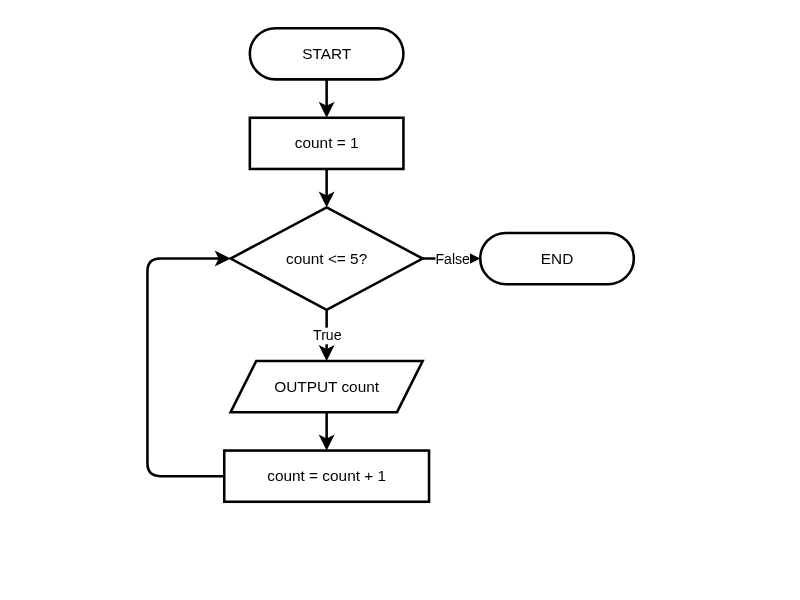
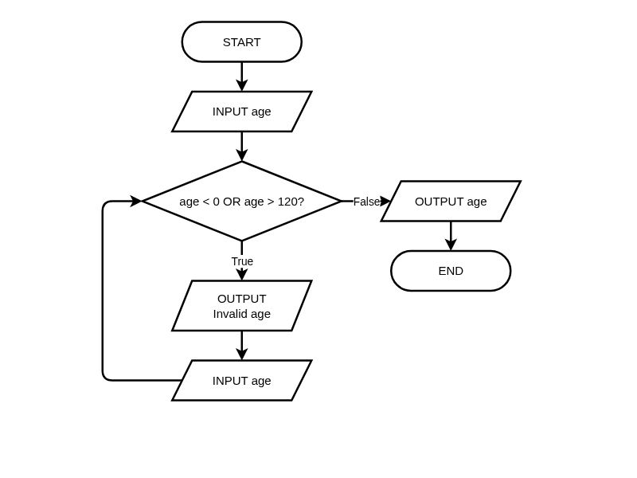

# Conditional Loops (WHILE) and Input Validation

**Description:** Learn to design algorithms with indefinite iteration, sentinel values, and robust input validation.

**Duration:** 20-30 minutes  
**Learning Mode:** Read explanations, watch videos, complete exercises

---

# Conditional Loops (WHILE) and Input Validation

## Learning Objectives
- Understand **indefinite iteration** and when to use it
- Design algorithms using **pre-test** (WHILE) loops
- Implement **sentinel-controlled** loops
- Apply the **input validation pattern**
- Avoid and debug **infinite loops**

---

## Choosing the Right Loop Type

This is a critical algorithm design decision:

| Situation | Loop Type | Why |
|-----------|-----------|-----|
| Known count: "Do this 10 times" | **FOR** | Definite iteration |
| Known collection: "Process each item" | **FOR** | Iterate through items |
| Unknown count: "Keep going until..." | **WHILE** | Indefinite iteration |
| User-dependent: "Until user says stop" | **WHILE** | Can't predict iterations |

### Key Insight:
> Use **FOR** when you know how many times.
> Use **WHILE** when you know **when to stop**.

## 🧪 Loop Type Selection

**Question:** You need to process items in a list of 100 elements. Which loop is most appropriate?

A) WHILE — because we're processing data
B) FOR — because we know there are exactly 100 items
C) Either would work equally well
D) We need both loops together

<details>
<summary><b>Show Answer</b></summary>

**Answer:** B

**Explanation:** When you know exactly how many iterations (100 items), FOR is the right choice. It's clearer and less error-prone than manually managing a counter with WHILE.

</details>


## The WHILE Loop (Pre-test Repetition)

A **WHILE loop** keeps repeating **as long as a condition is TRUE**.

This is called a **pre-test loop** because the condition is tested BEFORE each iteration.

### HSC Pseudocode Syntax:
```
WHILE condition
    statements
ENDWHILE
```

### Simple Example - Countdown:
```
BEGIN Countdown
    SET count TO 5
    WHILE count > 0
        OUTPUT count
        SET count TO count - 1
    ENDWHILE
    OUTPUT "Blast off!"
END Countdown
```

## 📊 WHILE Loop Flowchart (Pre-test Repetition)

_WHILE loop (pre-test): Initialize counter, test condition BEFORE body executes, True flows DOWN through body, loop back on the LEFT side, False exits to END — NESA HSC standard_



_Click the diagram to open in full editor_


## 🧪 Quick Check: Loop Choice

**Question:** You want to keep asking the user for a password until they enter the correct one. Which loop should you use?

A) FOR loop — because passwords have a fixed length
B) WHILE loop — because you don't know how many attempts they'll need
C) Either would work equally well
D) Neither — use IF/ELSE instead

<details>
<summary><b>Show Answer</b></summary>

**Answer:** B

**Explanation:** Use a WHILE loop when you don't know in advance how many iterations you need. The user might get it right on the first try, or the tenth!

</details>


## Sentinel Values: Signaling When to Stop

A **sentinel value** is a special value that signals the end of input.

### Common Sentinel Values:
| Data Type | Sentinel Examples |
|-----------|------------------|
| Numbers | -1, 0, -999, 999 |
| Strings | "quit", "exit", "done", empty string |
| Other | null, None, EOF (end of file) |

### Example: Sum until -1
```
BEGIN SumUntilSentinel
    SET total TO 0
    OUTPUT "Enter a number (-1 to stop): "
    INPUT number
    
    WHILE number != -1
        SET total TO total + number
        OUTPUT "Enter a number (-1 to stop): "
        INPUT number
    ENDWHILE
    
    OUTPUT "Total: " + total
END SumUntilSentinel
```

### Design Consideration:
Choose a sentinel that **cannot be valid data**. If -1 could be a legitimate input, use a different sentinel!

## 🧪 Sentinel Value Design

**Question:** You're designing an algorithm to average test scores (0-100). Which would be a POOR choice for a sentinel value?

A) -1 — it's outside the valid range
B) 0 — it could be a valid score
C) 999 — it's outside the valid range
D) -999 — it's outside the valid range

<details>
<summary><b>Show Answer</b></summary>

**Answer:** B

**Explanation:** 0 is a valid test score! Using it as a sentinel would prevent users from entering an actual score of 0. Choose sentinels that cannot be confused with valid data.

</details>


## 📊 Input Validation Pattern Flowchart

_Input Validation: Get initial input, validate, True (invalid) flows DOWN to error message and re-prompt, loop back on the LEFT, False (valid) exits to process and END — NESA HSC standard_



_Click the diagram to open in full editor_


## Input Validation Pattern

One of the most common uses of WHILE loops is **input validation** — ensuring user input is acceptable.

### Pattern Structure in Pseudocode:
```
BEGIN ValidateInput
    OUTPUT "Enter a value:"
    INPUT value
    
    WHILE value is invalid
        OUTPUT "Invalid input, try again:"
        INPUT value
    ENDWHILE
    
    ' Now value is guaranteed to be valid
    Process value
END ValidateInput
```

### Example: Validate Age (0-130)
```
BEGIN GetValidAge
    OUTPUT "Enter your age: "
    INPUT age
    
    WHILE age < 0 OR age > 130
        OUTPUT "Invalid age. Must be between 0 and 130."
        OUTPUT "Enter your age: "
        INPUT age
    ENDWHILE
    
    OUTPUT "Your age is: " + age
END GetValidAge
```

### The "Priming Read" Concept:
Notice we get input BEFORE the loop starts. This is called a **priming read** — it initializes the variable so the WHILE condition can be evaluated the first time.

## ✍️ Practice: Password Validation

Write pseudocode for a password checker that:
1. Keeps asking for a password until the user enters "secret123"
2. Prints "Access granted" when the correct password is entered

Use the input validation pattern with a priming read.

**Starter Code:**
```
BEGIN PasswordChecker
    ' Get initial password (priming read)
    
    ' Keep asking while password is wrong
    
    ' Print success message
    
END PasswordChecker
```

**Hints:**
- Start with OUTPUT and INPUT before the loop (priming read)
- The condition is: password != "secret123"
- Get new input inside the loop
- The success message goes after the loop ends


```python
# Write your pseudocode here as Python comments
# Remember to use proper indentation and HSC conventions

"""
BEGIN PasswordChecker
    ' Get initial password (priming read)
    
    ' Keep asking while password is wrong
    
    ' Print success message
    
END PasswordChecker
"""

```

**Example Answer:**


```python
# Example solution
BEGIN PasswordChecker
    OUTPUT "Enter password: "
    INPUT password
    
    WHILE password != "secret123"
        OUTPUT "Incorrect. Try again: "
        INPUT password
    ENDWHILE
    
    OUTPUT "Access granted"
END PasswordChecker
```

## ⚠️ Danger: Infinite Loops!

An **infinite loop** runs forever because the condition never becomes False.

### Common Causes:

**1. Forgetting to update the variable:**
```
SET count TO 5
WHILE count > 0
    OUTPUT count
    ' Oops! We never change count, so count > 0 is always True
ENDWHILE
```

**2. Condition that can never be False:**
```
WHILE True
    OUTPUT "Forever..."
ENDWHILE
```

**3. Updating in the wrong direction:**
```
SET count TO 5
WHILE count > 0
    OUTPUT count
    SET count TO count + 1    ' Oops! count gets bigger, not smaller!
ENDWHILE
```

### Prevention Checklist:
1. Does something in the loop change the condition variable?
2. Does the change move TOWARD making the condition false?
3. Is there any path through the loop that skips the update?

## 🧪 Spot the Infinite Loop

**Question:** Which of these loops will run infinitely?

A) x = 10; WHILE x > 0: x = x - 1
B) x = 1; WHILE x < 10: x = x + 1
C) x = 5; WHILE x != 0: x = x - 2
D) x = 10; WHILE x > 0: OUTPUT x; x = x - 1

<details>
<summary><b>Show Answer</b></summary>

**Answer:** C

**Explanation:** Starting at 5 and subtracting 2: 5 → 3 → 1 → -1 → -3... The value jumps from 1 to -1, never hitting exactly 0, so x != 0 stays True forever!

</details>


## ✍️ Practice: Guessing Game

Write pseudocode for a number guessing game:
1. Set a secret number (e.g., 7)
2. Ask the user to guess
3. If too high, say "Too high!"
4. If too low, say "Too low!"
5. Keep asking until they guess correctly
6. Say "Correct!" and show how many guesses it took

**Starter Code:**
```
BEGIN GuessingGame
    SET secret TO 7
    SET guess TO 0
    SET attempts TO 0
    
    ' Keep guessing until correct
    
    OUTPUT "Correct! You took " + attempts + " guesses."
END GuessingGame
```

**Hints:**
- Use WHILE guess != secret
- Increment attempts inside the loop
- Use nested IF to check too high or too low
- The 'Correct!' message is after the loop ends


```python
# Write your pseudocode here as Python comments
# Remember to use proper indentation and HSC conventions

"""
BEGIN GuessingGame
    SET secret TO 7
    SET guess TO 0
    SET attempts TO 0
    
    ' Keep guessing until correct
    
    OUTPUT "Correct! You took " + attempts + " guesses."
END GuessingGame
"""

```

**Example Answer:**


```python
# Example solution
BEGIN GuessingGame
    SET secret TO 7
    SET guess TO 0
    SET attempts TO 0
    
    WHILE guess != secret
        OUTPUT "Guess the number:"
        INPUT guess
        SET attempts TO attempts + 1
        
        IF guess > secret THEN
            OUTPUT "Too high!"
        ELSEIF guess < secret THEN
            OUTPUT "Too low!"
        ENDIF
    ENDWHILE
    
    OUTPUT "Correct! You took " + attempts + " guesses."
END GuessingGame
```

## 🧪 Loop Termination

**Question:** In the pseudocode below, how many times will "Hi" be output?

```
SET x TO 3
WHILE x > 0
    OUTPUT "Hi"
    SET x TO x - 1
ENDWHILE
```

A) 0 times
B) 2 times
C) 3 times
D) Infinite times

<details>
<summary><b>Show Answer</b></summary>

**Answer:** C

**Explanation:** x starts at 3. Loop runs when x=3, x=2, x=1. When x becomes 0, the condition x > 0 is False and the loop stops. That's 3 iterations.

</details>


## 🧪 Loop Design Analysis

**Question:** What is the algorithmic purpose of the 'priming read' (getting input BEFORE the while loop starts)?

A) It makes the code run faster
B) It ensures the loop condition can be evaluated on first check
C) It's just a coding style preference
D) It prevents the loop from running at all

<details>
<summary><b>Show Answer</b></summary>

**Answer:** B

**Explanation:** The priming read initializes the variable so the WHILE condition can be evaluated the first time. Without it, you'd be checking an undefined or default value.

</details>


## 🐍 Python Translation: Menu System

Now let's see how a WHILE loop translates to Python. This menu system demonstrates the input validation pattern.

Study how the pseudocode concepts translate:
- `WHILE` → `while`
- `ENDWHILE` → indentation ends
- `IF/ELSEIF/ENDIF` → `if/elif` with indentation

**Hints:**
- Initialize choice to something other than 3 so the loop starts
- Use if/elif/else inside the loop to handle each choice
- Choice 3 should print 'Exiting...' before the loop ends


```python
choice = 0

while choice != 3:
    print("\n--- Menu ---")
    print("1) Say Hello")
    print("2) Say Goodbye")
    print("3) Exit")
    
    choice = int(input("Enter choice: "))
    
    # Add if/elif to handle each choice
    
print("Program ended.")
```

**Example Solution:**


```python
# Example solution
choice = 0

while choice != 3:
    print("\n--- Menu ---")
    print("1) Say Hello")
    print("2) Say Goodbye")
    print("3) Exit")
    
    choice = int(input("Enter choice: "))
    
    if choice == 1:
        print("Hello!")
    elif choice == 2:
        print("Goodbye!")
    elif choice == 3:
        print("Exiting...")
    else:
        print("Invalid choice!")

print("Program ended.")
```

## Pseudocode to Python Translation

| HSC Pseudocode | Python |
|----------------|--------|
| `WHILE condition` | `while condition:` |
| `ENDWHILE` | (end of indented block) |
| `!=` | `!=` |
| `AND` | `and` |
| `OR` | `or` |
| `NOT` | `not` |

### Key Difference:
Python uses **indentation** to show what's inside the loop, while pseudocode uses `ENDWHILE` to mark the end.

## 📝 Reflection: Validation in the Real World

Think about websites or apps you use. Describe ONE example of input validation you've encountered. What was the input field? What made input 'invalid'? How did the system respond to invalid input?

**Example Answer:**

When creating a password on most websites, there's input validation. The input field is the password box. Invalid input might be a password that's too short (less than 8 characters), doesn't contain a number, or doesn't have a special character. The system responds by showing a red error message explaining what's wrong, and won't let you proceed until you fix it. This is like a WHILE loop that keeps you on the page until password is valid.


## ✅ Lesson Complete!

You've completed this lesson. Make sure you:

- ✓ Watched all videos
- ✓ Read all explanations
- ✓ Completed all exercises
- ✓ Answered all quiz questions

**Ready for the next lesson?** Continue to the next notebook!
