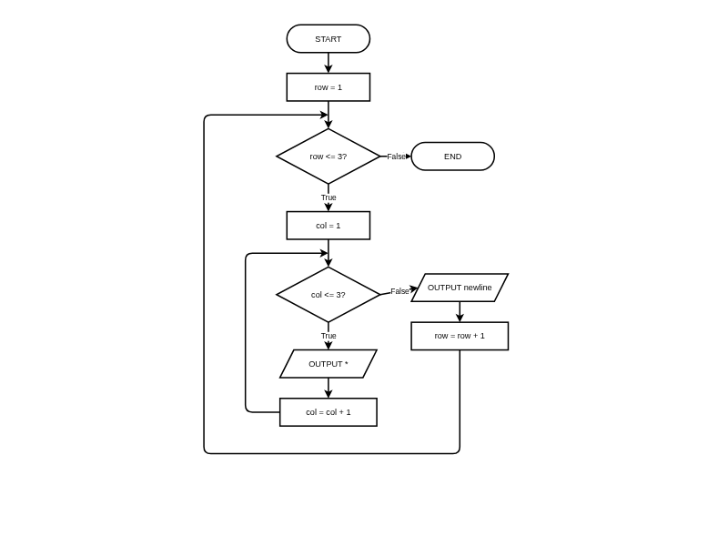

# Nested Loops (Loops within Loops)

**Description:** Learn to decompose 2D problems and use nested iteration for grids, tables, and patterns.

**Duration:** 20-30 minutes  
**Learning Mode:** Read explanations, watch videos, complete exercises

---

# Nested Loops (Loops within Loops)

## Learning Objectives
- Understand what nested loops are and when to use them
- **Recognize problems** that require nested iteration
- Apply **2D thinking** to algorithm design
- Trace through nested loop execution step by step
- Create grids, patterns, and tables

---

## Recognizing Nested Loop Problems

Nested loops are needed when you have **repetition within repetition**.

### Pattern Recognition:
| Problem Description | Nested Loops? |
|---------------------|---------------|
| "For each row, do something for each column" | ✓ Yes |
| "For each item, compare with every other item" | ✓ Yes |
| "Process a 2D grid/table/matrix" | ✓ Yes |
| "Print each item in a single list" | ✗ No (single loop) |

### Examples That Need Nested Loops:
- Multiplication tables (each row × each column)
- Drawing rectangles (each row × each position in row)
- Game boards (each row × each cell)
- Finding all pairs in a list

## 🧪 Recognizing Nested Loop Scenarios

**Question:** Which problem requires nested loops?

A) Find the sum of numbers 1 to 100
B) Print a 5×5 grid of stars
C) Count how many even numbers in a list
D) Ask user for 10 names and store them

<details>
<summary><b>Show Answer</b></summary>

**Answer:** B

**Explanation:** A 5×5 grid needs nested loops: outer loop for rows (5 times), inner loop for columns (5 times per row). The other problems need only single loops.

</details>


## How Nested Loops Execute

Think of it like a clock:

- The **inner loop** is like the minute hand — it goes all the way around
- The **outer loop** is like the hour hand — it moves once after the inner loop completes a full cycle

```
Outer = 0:  Inner = 0, 1, 2  (inner completes)
Outer = 1:  Inner = 0, 1, 2  (inner completes again)
Outer = 2:  Inner = 0, 1, 2  (inner completes again)
```

### Key Insight:
The **inner loop runs completely** for **each iteration** of the outer loop.

### Calculating Total Iterations:
**Total = Outer iterations × Inner iterations**

Example: Outer runs 4 times, Inner runs 5 times each = 4 × 5 = 20 total iterations

## 📊 Nested Loop Flowchart Structure

_Nested Loops: Outer loop (row) controls rows, inner loop (col) controls columns. Inner loop completes fully for each outer iteration. Loops back on the LEFT side — NESA HSC standard_




## 🧪 Quick Check: Counting Iterations

**Question:** How many times will the inner process execute if the outer loop runs 4 times and the inner loop runs 5 times for each outer iteration?

A) 4 times
B) 5 times
C) 9 times
D) 20 times

<details>
<summary><b>Show Answer</b></summary>

**Answer:** D

**Explanation:** The outer loop runs 4 times. For each outer iteration, the inner loop runs 5 times. Total: 4 × 5 = 20 times.

</details>


## 2D Thinking: Rows and Columns

Nested loops naturally map to **two dimensions**:

```
Outer loop = ROWS (vertical, top to bottom)
Inner loop = COLUMNS (horizontal, left to right)
```

### Pseudocode Pattern for a Grid:
```
BEGIN PrintGrid
    FOR row = 1 TO 3 STEP 1
        FOR col = 1 TO 5 STEP 1
            OUTPUT "*"
        NEXT col
        OUTPUT newline
    NEXT row
END PrintGrid
```

Output:
```
*****  (Row 1: 5 columns)
*****  (Row 2: 5 columns)
*****  (Row 3: 5 columns)
```

### Design Process:
1. **Identify the outer dimension** (usually rows)
2. **Identify the inner dimension** (usually columns)
3. **Determine what happens at each (row, col) position**
4. **Handle row endings** (new line after each row)

## 🧪 2D Problem Decomposition

**Question:** You need to check every cell in a 10×10 game board. How should you decompose this?

A) One loop of 100 iterations
B) Outer loop for rows (10), inner loop for columns (10)
C) Inner loop for rows, outer loop for columns
D) Both B and C work equally well

<details>
<summary><b>Show Answer</b></summary>

**Answer:** D

**Explanation:** Either row-major (rows outer, columns inner) or column-major order works. Convention typically uses row-major, but both visit all 100 cells.

</details>


## Pattern 1: Rectangle of Symbols

The simplest nested loop pattern creates a rectangular grid.

### Pseudocode:
```
BEGIN DrawRectangle
    FOR row = 1 TO 4 STEP 1
        FOR col = 1 TO 6 STEP 1
            OUTPUT "#"
        NEXT col
        OUTPUT newline
    NEXT row
END DrawRectangle
```

Output:
```
######
######
######
######
```

### Understanding the Structure:
- Outer loop controls HOW MANY rows
- Inner loop controls HOW MANY symbols per row
- After each row completes, output a newline

## ✍️ Practice: Draw a Rectangle

Write pseudocode to draw a rectangle of `@` symbols with:
- 3 rows
- 7 columns

Expected output:
```
@@@@@@@
@@@@@@@
@@@@@@@
```

**Starter Code:**
```
BEGIN DrawRectangle
    ' Outer loop for rows
    
    ' Inner loop for columns
    
END DrawRectangle
```

**Hints:**
- Outer loop runs 3 times (for rows)
- Inner loop runs 7 times (for columns)
- Don't forget OUTPUT newline after each row
- Use HSC FOR syntax: FOR var = start TO end STEP 1


```python
# Write your pseudocode here as Python comments
# Remember to use proper indentation and HSC conventions

"""
BEGIN DrawRectangle
    ' Outer loop for rows
    
    ' Inner loop for columns
    
END DrawRectangle
"""

```

<details>
<summary><b>Example Answer</b></summary>

```
# Example solution
BEGIN DrawRectangle
    FOR row = 1 TO 3 STEP 1
        FOR col = 1 TO 7 STEP 1
            OUTPUT "@"
        NEXT col
        OUTPUT newline
    NEXT row
END DrawRectangle
```

</details>

## Pattern 2: Multiplication Table

Nested loops can generate tables of calculated values.

### Pseudocode:
```
BEGIN MultiplicationTable
    FOR row = 1 TO 5 STEP 1
        FOR col = 1 TO 5 STEP 1
            SET product TO row * col
            OUTPUT product + " "
        NEXT col
        OUTPUT newline
    NEXT row
END MultiplicationTable
```

Output:
```
1 2 3 4 5
2 4 6 8 10
3 6 9 12 15
4 8 12 16 20
5 10 15 20 25
```

### Key Insight:
At each position, we calculate `row × col`. The nested structure ensures every combination is computed.

## ✍️ Practice: Coordinate Grid

Write pseudocode that outputs all coordinate pairs for a 3×3 grid:

```
(0,0) (0,1) (0,2)
(1,0) (1,1) (1,2)
(2,0) (2,1) (2,2)
```

The first number is the row, the second is the column.

**Starter Code:**
```
BEGIN CoordinateGrid
    ' Nested loops to print coordinates
    
END CoordinateGrid
```

**Hints:**
- Outer loop for rows (0 to 2)
- Inner loop for columns (0 to 2)
- Output row and col values as coordinates
- New line after each row completes


```python
# Write your pseudocode here as Python comments
# Remember to use proper indentation and HSC conventions

"""
BEGIN CoordinateGrid
    ' Nested loops to print coordinates
    
END CoordinateGrid
"""

```

<details>
<summary><b>Example Answer</b></summary>

```
# Example solution
BEGIN CoordinateGrid
    FOR row = 0 TO 2 STEP 1
        FOR col = 0 TO 2 STEP 1
            OUTPUT "(" + row + "," + col + ") "
        NEXT col
        OUTPUT newline
    NEXT row
END CoordinateGrid
```

</details>

## Pattern 3: Triangle Patterns (Dependent Loops)

When the inner loop depends on the outer loop variable, you get **triangular** patterns.

### Right Triangle:
```
BEGIN RightTriangle
    FOR row = 1 TO 5 STEP 1
        FOR col = 1 TO row STEP 1    ' Inner depends on row!
            OUTPUT "*"
        NEXT col
        OUTPUT newline
    NEXT row
END RightTriangle
```

Output:
```
*
**
***
****
*****
```

### How it works:
- Row 1: inner runs 1 time → `*`
- Row 2: inner runs 2 times → `**`
- Row 3: inner runs 3 times → `***`
- And so on...

## 📊 Triangle Pattern Flowchart (Dependent Inner Loop)

_Triangle Pattern: Inner loop limit depends on outer loop variable (col <= row). Creates growing triangle pattern. Loop back on the LEFT side — NESA HSC standard_


## 🧪 Understanding Dependent Loops

**Question:** In the code `FOR row = 1 TO 5: FOR col = 1 TO row`, how many stars are printed in total?

A) 5 stars
B) 10 stars
C) 15 stars
D) 25 stars

<details>
<summary><b>Show Answer</b></summary>

**Answer:** C

**Explanation:** Row 1: 1 star. Row 2: 2 stars. Row 3: 3 stars. Row 4: 4 stars. Row 5: 5 stars. Total: 1+2+3+4+5 = 15 stars.

</details>


## ✍️ Practice: Number Triangle

Write pseudocode to create a number triangle pattern:

```
1
12
123
1234
12345
```

Hint: Output the column number instead of a symbol.

**Starter Code:**
```
BEGIN NumberTriangle
    ' Outer loop for rows
    
    ' Inner loop depends on row
    
END NumberTriangle
```

**Hints:**
- Outer loop: FOR row = 1 TO 5
- Inner loop: FOR col = 1 TO row (dependent!)
- Output 'col' (the column number) instead of a symbol
- Don't forget the newline after each row


```python
# Write your pseudocode here as Python comments
# Remember to use proper indentation and HSC conventions

"""
BEGIN NumberTriangle
    ' Outer loop for rows
    
    ' Inner loop depends on row
    
END NumberTriangle
"""

```

<details>
<summary><b>Example Answer</b></summary>

```
# Example solution
BEGIN NumberTriangle
    FOR row = 1 TO 5 STEP 1
        FOR col = 1 TO row STEP 1
            OUTPUT col
        NEXT col
        OUTPUT newline
    NEXT row
END NumberTriangle
```

</details>

## 🧪 Tracing Nested Loops

**Question:** What does this pseudocode output?

```
FOR i = 0 TO 1 STEP 1
    FOR j = 0 TO 2 STEP 1
        OUTPUT i + j
    NEXT j
    OUTPUT newline
NEXT i
```

A) 0 1 2&lt;br&gt;1 2 3
B) 0 1&lt;br&gt;1 2&lt;br&gt;2 3
C) 0 0 0&lt;br&gt;1 1 1
D) 0 1 2 3 4 5

<details>
<summary><b>Show Answer</b></summary>

**Answer:** A

**Explanation:** i=0: outputs 0+0, 0+1, 0+2 → '0 1 2', then newline. i=1: outputs 1+0, 1+1, 1+2 → '1 2 3', then newline.

</details>


## When to Use Nested Loops

| Problem Type | Example |
|--------------|--------|
| Grids/Tables | Multiplication table, game board |
| 2D Patterns | Star triangles, pixel art |
| Comparing pairs | Find all pairs of items |
| Processing 2D data | Image pixels, spreadsheet cells |
| Repeating a sequence | "Do X, Y, Z" five times |

## 🐍 Python Translation: Multiplication Table

Now let's see how nested loops translate to Python. Create a 4×4 multiplication table.

Notice how the pseudocode structure maps directly to Python:
- `FOR row = 1 TO 4 STEP 1` → `for row in range(1, 5)`
- `NEXT row` → (end of indented block)

**Hints:**
- Use range(1, 5) for both loops (1 through 4)
- Calculate row * col for each cell
- Use f"{value:3}" for 3-character width formatting
- Use end="" to stay on same line, print() for newline


```python
# Create a 4x4 multiplication table
for row in range(1, 5):
    for col in range(1, 5):
        # Calculate and print product with formatting
        pass
    # Print newline after each row
    pass
```

<details>
<summary><b>Example Solution</b></summary>

```
# Example solution
# Create a 4x4 multiplication table
for row in range(1, 5):
    for col in range(1, 5):
        print(f"{row * col:3}", end="")
    print()
```

</details>

## Pseudocode to Python Translation

| HSC Pseudocode | Python |
|----------------|--------|
| `FOR i = 1 TO 5 STEP 1` | `for i in range(1, 6):` |
| `NEXT i` | (end of indented block) |
| `OUTPUT "*"` (same line) | `print("*", end="")` |
| `OUTPUT newline` | `print()` |

### Key Difference:
- Python's `range(1, 6)` gives 1, 2, 3, 4, 5 (excludes the end value)
- Pseudocode's `FOR i = 1 TO 5` is inclusive of both ends

## 🧪 Algorithm Efficiency

**Question:** An algorithm uses nested loops where both iterate n times. If n doubles, how do the total iterations change?

A) Double (2n)
B) Triple (3n)
C) Quadruple (4×)
D) Stay the same

<details>
<summary><b>Show Answer</b></summary>

**Answer:** C

**Explanation:** Nested loops give n × n = n² iterations. If n doubles to 2n, iterations become (2n)² = 4n². That's 4 times as many iterations!

</details>


## 📝 Reflection: Nested Loops in Games

Think about a simple grid-based game (like Tic-Tac-Toe, Chess, Minesweeper, or Battleship). How would nested loops be used to:

1. Draw the game board?
2. Check for a win condition?

Explain in your own words.

<details>
<summary><b>Example Answer</b></summary>

In Tic-Tac-Toe, nested loops would be used to draw the 3x3 grid. The outer loop goes through each row (0, 1, 2) and the inner loop goes through each column. For each cell, it prints X, O, or empty. To check for a win, you'd use nested loops to check all rows, all columns, and the diagonals to see if any have three matching symbols.

</details>

## ✅ Lesson Complete!

You've completed this lesson. Make sure you:

- ✓ Watched all videos
- ✓ Read all explanations
- ✓ Completed all exercises
- ✓ Answered all quiz questions

**Ready for the next lesson?** Continue to the next notebook!
