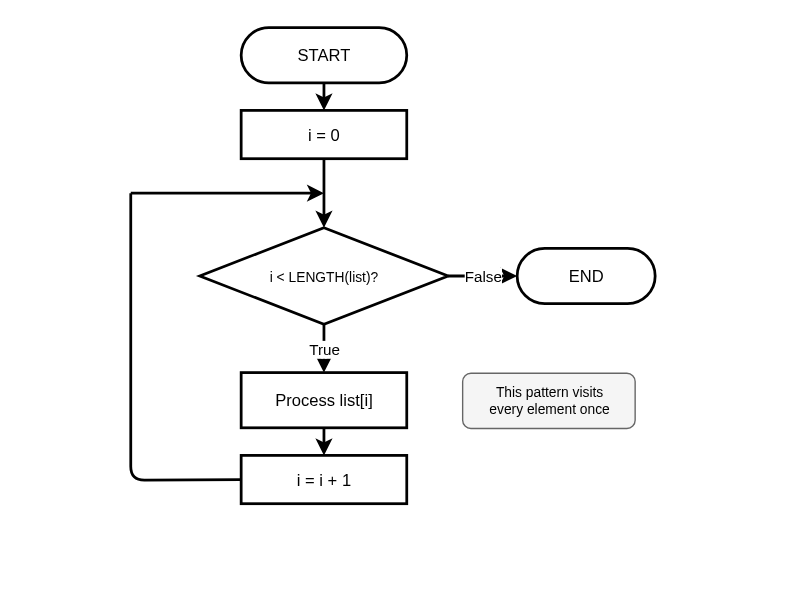
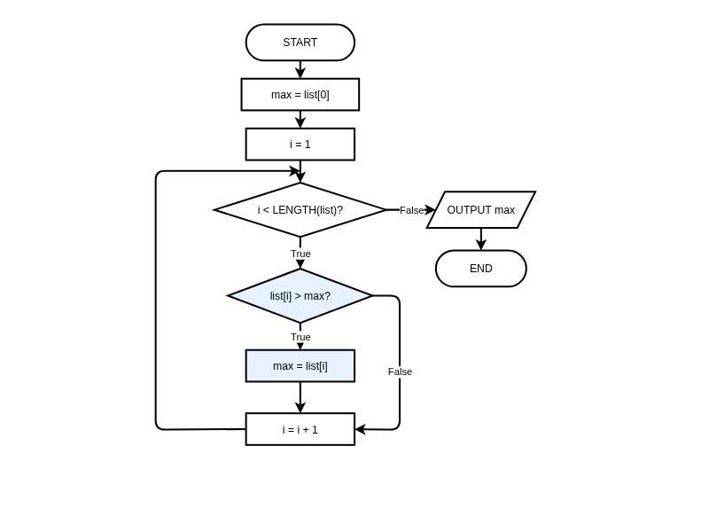

# Working with Lists (Arrays)

**Description:** Learn to select appropriate data structures and apply standard algorithms for processing collections of data.

**Duration:** 20-30 minutes  
**Learning Mode:** Read explanations, watch videos, complete exercises

---

# Working with Lists (Arrays)

## Learning Objectives
- Understand when to use **lists** (arrays) vs single variables
- Apply **standard list algorithms** (traverse, search, find max/min)
- Recognize patterns for list processing
- Choose the right approach for list problems

---

## When to Use Lists

**Lists** (called arrays in pseudocode) store multiple related values in a single structure.

### Decision Guide:
| Situation | Use |
|-----------|-----|
| Fixed number of known values | Individual variables |
| Collection of related items | List |
| Unknown number of items | List |
| Need to process items uniformly | List |
| Data naturally groups together | List |

### Example Problem:
Imagine storing scores for 30 students. With individual variables you'd need `score1`, `score2`, ... `score30`. With a list, you just need `scores` and can process all 30 with a loop!

## 🧪 Data Structure Selection

**Question:** You need to store and process test scores for a class of 30 students. Which approach is best?

A) 30 individual variables (score1, score2, ...)
B) A single list containing all 30 scores
C) 30 separate variables and manual processing
D) It doesn't matter — both work equally well

<details>
<summary><b>Show Answer</b></summary>

**Answer:** B

**Explanation:** A list allows you to use loops to process all scores uniformly. With 30 variables, you'd need 30 separate statements for each operation — not scalable or maintainable.

</details>


## Array Basics in Pseudocode

### Declaring Arrays:
```
DECLARE scores AS ARRAY OF INTEGER
SET scores TO [85, 92, 78, 90, 88]
```

### Accessing Elements by Index:
Each item has a position called an **index**. **Indexes start at 0!**

```
fruits = ["apple", "banana", "cherry", "date"]
          ↑         ↑         ↑         ↑
        index 0   index 1   index 2   index 3
```

### Pseudocode Access:
```
SET first TO fruits[0]      ' "apple" — first item
SET second TO fruits[1]     ' "banana" — second item
SET last TO fruits[3]       ' "date" — last item
```

### Common Mistake:
```
OUTPUT fruits[4]    ' ERROR! Index out of range
                    ' Valid indexes are 0, 1, 2, 3
```

## 📊 List Traversal Flowchart

_List Traversal Pattern: Use an index counter to visit every element from 0 to LENGTH-1. This is the foundation of all list algorithms._



_Click the diagram to open in full editor_


## 🧪 Quick Check: Indexing

**Question:** Given `numbers = [10, 20, 30, 40, 50]`, what is `numbers[2]`?

A) 10
B) 20
C) 30
D) 40

<details>
<summary><b>Show Answer</b></summary>

**Answer:** C

**Explanation:** Index 2 is the THIRD element (since we start counting from 0). Index 0=10, Index 1=20, Index 2=30.

</details>


## Standard List Algorithms

These algorithms appear repeatedly in programming. Master them!

### 1. Traversal (Visit Every Element)
```
BEGIN TraverseList
    FOR i = 0 TO LENGTH(list) - 1 STEP 1
        OUTPUT list[i]
    NEXT i
END TraverseList
```

### 2. Sum All Elements (Accumulator Pattern)
```
BEGIN SumList
    SET total TO 0
    FOR i = 0 TO LENGTH(numbers) - 1 STEP 1
        SET total TO total + numbers[i]
    NEXT i
    OUTPUT total
END SumList
```

### 3. Find Maximum (Best-So-Far Pattern)
```
BEGIN FindMaximum
    SET maximum TO numbers[0]
    FOR i = 1 TO LENGTH(numbers) - 1 STEP 1
        IF numbers[i] > maximum THEN
            SET maximum TO numbers[i]
        ENDIF
    NEXT i
    OUTPUT maximum
END FindMaximum
```

## 📊 Find Maximum Flowchart

_Find Maximum Algorithm: Start with first element as 'best so far', then compare each remaining element and update if better._



_Click the diagram to open in full editor_


## ✍️ Practice: Sum of List

Write pseudocode to calculate the sum of all numbers in a list.

Use the accumulator pattern:
1. Initialize total to 0
2. Loop through each element
3. Add each element to total

**Starter Code:**
```
BEGIN SumList
    SET numbers TO [10, 25, 30, 15, 20]
    
    ' Calculate sum using a loop
    
    OUTPUT "Sum: " + total
END SumList
```

**Hints:**
- Initialize total = 0 before the loop
- Use FOR i = 0 TO LENGTH(numbers) - 1
- Add numbers[i] to total each iteration


```python
# Write your pseudocode here as Python comments
# Remember to use proper indentation and HSC conventions

"""
BEGIN SumList
    SET numbers TO [10, 25, 30, 15, 20]
    
    ' Calculate sum using a loop
    
    OUTPUT "Sum: " + total
END SumList
"""

```

**Example Answer:**


```python
# Example solution
BEGIN SumList
    SET numbers TO [10, 25, 30, 15, 20]
    SET total TO 0
    
    FOR i = 0 TO LENGTH(numbers) - 1 STEP 1
        SET total TO total + numbers[i]
    NEXT i
    
    OUTPUT "Sum: " + total
END SumList
```

## ✍️ Practice: Find Minimum

Write pseudocode to find the minimum (smallest) value in a list.

This is the opposite of Find Maximum - use `<` instead of `>`.

**Starter Code:**
```
BEGIN FindMinimum
    SET numbers TO [34, 67, 23, 89, 12, 78]
    
    ' Find minimum using best-so-far pattern
    
    OUTPUT "Minimum: " + minimum
END FindMinimum
```

**Hints:**
- Initialize minimum to the first element: numbers[0]
- Loop starting from index 1 (we already have index 0)
- If current number is SMALLER than minimum, update minimum


```python
# Write your pseudocode here as Python comments
# Remember to use proper indentation and HSC conventions

"""
BEGIN FindMinimum
    SET numbers TO [34, 67, 23, 89, 12, 78]
    
    ' Find minimum using best-so-far pattern
    
    OUTPUT "Minimum: " + minimum
END FindMinimum
"""

```

**Example Answer:**


```python
# Example solution
BEGIN FindMinimum
    SET numbers TO [34, 67, 23, 89, 12, 78]
    SET minimum TO numbers[0]
    
    FOR i = 1 TO LENGTH(numbers) - 1 STEP 1
        IF numbers[i] < minimum THEN
            SET minimum TO numbers[i]
        ENDIF
    NEXT i
    
    OUTPUT "Minimum: " + minimum
END FindMinimum
```

## Linear Search Algorithm

Searching is a fundamental operation - finding whether a value exists in a list and where it is.

### Linear Search Pseudocode:
```
BEGIN LinearSearch
    SET list TO [10, 25, 30, 15, 40]
    SET target TO 30
    SET found TO FALSE
    SET position TO -1
    
    FOR i = 0 TO LENGTH(list) - 1 STEP 1
        IF list[i] = target THEN
            SET found TO TRUE
            SET position TO i
        ENDIF
    NEXT i
    
    IF found = TRUE THEN
        OUTPUT "Found at index " + position
    ELSE
        OUTPUT "Not found"
    ENDIF
END LinearSearch
```

### Key Characteristics:
- Checks each element one by one (hence "linear")
- Works on unsorted lists
- Simple but can be slow for very large lists

## ✍️ Practice: Count Matching Items

Write pseudocode to count how many even numbers are in a list.

Remember: A number is even if `number MOD 2 = 0`

**Starter Code:**
```
BEGIN CountEvens
    SET numbers TO [1, 4, 6, 7, 9, 10, 12, 15, 18]
    
    ' Count even numbers
    
    OUTPUT "Even count: " + count
END CountEvens
```

**Hints:**
- Initialize count = 0
- Loop through each number
- Check if numbers[i] MOD 2 = 0 (even)
- If even, increment count


```python
# Write your pseudocode here as Python comments
# Remember to use proper indentation and HSC conventions

"""
BEGIN CountEvens
    SET numbers TO [1, 4, 6, 7, 9, 10, 12, 15, 18]
    
    ' Count even numbers
    
    OUTPUT "Even count: " + count
END CountEvens
"""

```

**Example Answer:**


```python
# Example solution
BEGIN CountEvens
    SET numbers TO [1, 4, 6, 7, 9, 10, 12, 15, 18]
    SET count TO 0
    
    FOR i = 0 TO LENGTH(numbers) - 1 STEP 1
        IF numbers[i] MOD 2 = 0 THEN
            SET count TO count + 1
        ENDIF
    NEXT i
    
    OUTPUT "Even count: " + count
END CountEvens
```

## 🧪 Understanding LENGTH()

**Question:** If `data = [5, 10, 15, 20]`, what is the valid range of indexes?

A) 1 to 4
B) 0 to 4
C) 0 to 3
D) 1 to 3

<details>
<summary><b>Show Answer</b></summary>

**Answer:** C

**Explanation:** The list has 4 elements (LENGTH=4). Indexes start at 0, so valid indexes are 0, 1, 2, 3 (that's 0 to LENGTH-1).

</details>


## 🧪 Choosing the Right Algorithm

**Question:** You need to find all numbers greater than 50 from a list of test scores. Which standard algorithm applies?

A) Traversal — visit each element
B) Search — find a specific element
C) Filter — select elements matching a condition
D) Transform — change each element

<details>
<summary><b>Show Answer</b></summary>

**Answer:** C

**Explanation:** Filter selects a subset of elements that match a condition (score > 50). Search finds ONE specific element. Transform would change the values, not select them.

</details>


## Algorithm Design with Lists

### Key Questions When Processing Lists:

1. **Do I need all elements?** → Traversal
2. **Do I need to find something?** → Search
3. **Do I need the best/worst?** → Find max/min
4. **Do I need a subset?** → Filter
5. **Do I need to change values?** → Transform
6. **Do I need a single value from all?** → Reduce (sum, count, etc.)

### Common Mistakes to Avoid:
| Mistake | Problem | Solution |
|---------|---------|----------|
| Index out of range | Accessing beyond LENGTH | Use LENGTH() - 1 as upper bound |
| Forgetting lists are zero-indexed | Off-by-one errors | First element is index 0 |
| Not initializing accumulator | Undefined starting value | Set to 0, first element, or empty list |

## 🧪 List Algorithm Analysis

**Question:** To find the average of a list, which combination of operations is needed?

A) Just traversal
B) Search and filter
C) Sum (accumulator) and count (or LENGTH)
D) Transform and filter

<details>
<summary><b>Show Answer</b></summary>

**Answer:** C

**Explanation:** Average = sum ÷ count. You need to reduce the list to a sum (accumulator pattern), then divide by the count of elements (using LENGTH() or counter pattern).

</details>


## 🐍 Python Translation: Find Maximum

Now let's see how the Find Maximum algorithm translates to Python.

Notice the pseudocode patterns translate directly:
- `FOR i = 0 TO LENGTH(list) - 1` → `for i in range(len(numbers))`
- `list[i]` → `numbers[i]`

**Hints:**
- Initialize maximum to numbers[0] (first element)
- Loop from index 1 to len(numbers)-1
- Compare each element to maximum
- Update maximum when you find a larger value


```python
numbers = [34, 67, 23, 89, 45, 12, 78]

# Find maximum using best-so-far pattern
maximum = numbers[0]  # Start with first element

# Loop through remaining elements

# Print the result
print("Maximum:", maximum)
```

**Example Solution:**


```python
# Example solution
numbers = [34, 67, 23, 89, 45, 12, 78]

# Find maximum using best-so-far pattern
maximum = numbers[0]  # Start with first element

for i in range(1, len(numbers)):
    if numbers[i] > maximum:
        maximum = numbers[i]

# Print the result
print("Maximum:", maximum)
```

## Pseudocode to Python Translation

| HSC Pseudocode | Python |
|----------------|--------|
| `DECLARE list AS ARRAY` | `list = []` |
| `SET list TO [1, 2, 3]` | `list = [1, 2, 3]` |
| `list[0]` | `list[0]` |
| `LENGTH(list)` | `len(list)` |
| `FOR i = 0 TO LENGTH(list) - 1 STEP 1` | `for i in range(len(list)):` |
| `FOR EACH item IN list` | `for item in list:` |

## 🧪 Empty List Edge Case

**Question:** What happens if you try to find the maximum of an empty list using `maximum = list[0]`?

A) Returns 0
B) Returns None
C) Causes an IndexError
D) Works fine — just returns nothing

<details>
<summary><b>Show Answer</b></summary>

**Answer:** C

**Explanation:** Accessing list[0] on an empty list causes an IndexError — there is no first element! Always check if the list is empty before accessing elements.

</details>


## 📝 Reflection: Lists in Applications

Think about an app or system you use (social media, games, school systems). Identify ONE place where a list might be used behind the scenes. What data would be in the list? What operations might be performed on it?

**Example Answer:**

Instagram probably uses a list to store the posts on your feed. Each item in the list would be a post object with data like the image URL, caption, likes count, and username. Operations would include: adding new posts to the top of the list, removing posts you've hidden, and looping through the list to display each post on screen.


## ✅ Lesson Complete!

You've completed this lesson. Make sure you:

- ✓ Watched all videos
- ✓ Read all explanations
- ✓ Completed all exercises
- ✓ Answered all quiz questions

**Ready for the next lesson?** Continue to the next notebook!
