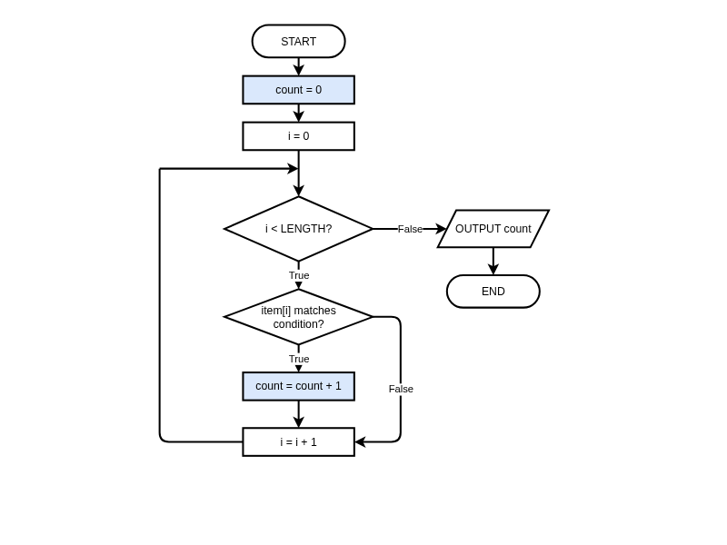
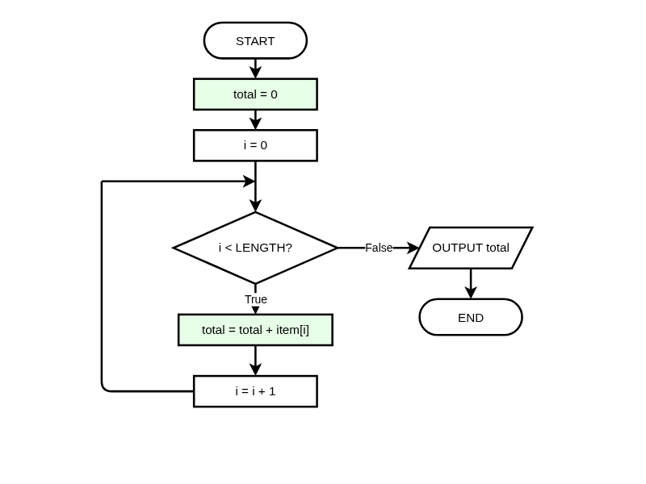
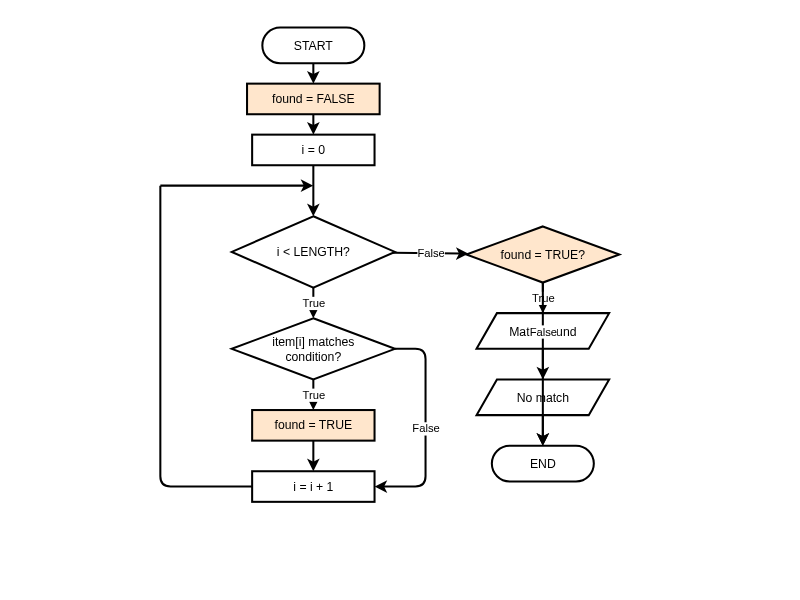

# Essential Algorithm Patterns

**Description:** Master the six fundamental algorithm patterns that form the building blocks of programming: Counter, Accumulator, Flag, Best-So-Far, Filter, and Transform.

**Duration:** 20-30 minutes  
**Learning Mode:** Read explanations, watch videos, complete exercises

---

# Essential Algorithm Patterns

## Learning Objectives
- Recognize and apply the **six fundamental patterns**
- Choose the correct pattern for a given problem
- Combine patterns to solve complex problems

---

## Why Learn Patterns?

Most algorithms are built from a small set of reusable patterns. Once you master these patterns, you can solve a huge variety of problems by recognizing which pattern applies.

| Pattern | Purpose | Example Use |
|---------|---------|-------------|
| Counter | Count occurrences | "How many students passed?" |
| Accumulator | Compute a total | "What is the sum of all sales?" |
| Flag | Track true/false state | "Does any item match the criteria?" |
| Best-So-Far | Find maximum/minimum | "What was the highest score?" |
| Filter | Select matching items | "Which products cost under $50?" |
| Transform | Change each item | "Apply 10% discount to all prices" |

## Pattern 1: Counter

Counts how many items match a condition.

### Pseudocode Template:
```
BEGIN CountPattern
    SET count TO 0
    FOR EACH item IN collection
        IF item matches condition THEN
            SET count TO count + 1
        ENDIF
    NEXT item
    OUTPUT count
END CountPattern
```

### Example: Count Passing Scores
```
BEGIN CountPassing
    SET scores TO [85, 42, 91, 55, 78, 33, 88]
    SET passCount TO 0
    
    FOR i = 0 TO LENGTH(scores) - 1 STEP 1
        IF scores[i] >= 50 THEN
            SET passCount TO passCount + 1
        ENDIF
    NEXT i
    
    OUTPUT "Passing students: " + passCount
END CountPassing
```
**Output:** Passing students: 5

## 📊 Counter Pattern Flowchart

_Counter Pattern: Initialize count to 0, increment when condition is true. Blue boxes highlight the counter-specific steps. Loop-back joins above the decision diamond per NESA spec._



_Click the diagram to open in full editor_


## Pattern 2: Accumulator

Builds up a running total or combined result.

### Pseudocode Template:
```
BEGIN AccumulatorPattern
    SET total TO 0    ' or empty string, 1 for product, etc.
    FOR EACH item IN collection
        SET total TO total + item
    NEXT item
    OUTPUT total
END AccumulatorPattern
```

### Example: Sum of Sales
```
BEGIN SumSales
    SET sales TO [150.50, 280.00, 95.75, 320.25]
    SET total TO 0
    
    FOR i = 0 TO LENGTH(sales) - 1 STEP 1
        SET total TO total + sales[i]
    NEXT i
    
    OUTPUT "Total sales: $" + total
END SumSales
```
**Output:** Total sales: $846.50

### Variations:
- **Product:** Start with 1, multiply instead of add
- **String concatenation:** Start with empty string, concatenate

## 📊 Accumulator Pattern Flowchart

_Accumulator Pattern: Initialize total to 0, add each item to the running total. Green boxes highlight accumulator steps. Loop-back joins above the decision diamond per NESA spec._



_Click the diagram to open in full editor_


## 🧪 Quick Check: Counter vs Accumulator

**Question:** You want to find the average age of users. Which patterns do you need?

A) Counter only
B) Accumulator only
C) Counter AND Accumulator
D) Neither — use Find Maximum

<details>
<summary><b>Show Answer</b></summary>

**Answer:** C

**Explanation:** Average = sum ÷ count. You need an Accumulator to sum all ages, and either a Counter or LENGTH() to count them, then divide.

</details>


## Pattern 3: Flag

Tracks whether something is true or false. Often used to check if ANY item matches, or if ALL items match.

### Pseudocode Template:
```
BEGIN FlagPattern
    SET found TO FALSE    ' or valid TO TRUE
    FOR EACH item IN collection
        IF item matches condition THEN
            SET found TO TRUE
        ENDIF
    NEXT item
    IF found = TRUE THEN
        OUTPUT "At least one match found"
    ELSE
        OUTPUT "No matches found"
    ENDIF
END FlagPattern
```

### Example: Check for Failing Student
```
BEGIN HasFailingScore
    SET scores TO [85, 72, 91, 42, 78]
    SET hasFail TO FALSE
    
    FOR i = 0 TO LENGTH(scores) - 1 STEP 1
        IF scores[i] < 50 THEN
            SET hasFail TO TRUE
        ENDIF
    NEXT i
    
    IF hasFail = TRUE THEN
        OUTPUT "Warning: At least one student failed"
    ELSE
        OUTPUT "All students passed!"
    ENDIF
END HasFailingScore
```

## 📊 Flag Pattern Flowchart

_Flag Pattern: Start FALSE, set TRUE when condition met. Orange boxes highlight flag-specific steps. Check flag after loop. Loop-back joins above the decision diamond per NESA spec._



_Click the diagram to open in full editor_


## Pattern 4: Best-So-Far

Finds the maximum or minimum value by comparing each item to the current best.

### Pseudocode Template:
```
BEGIN BestSoFarPattern
    SET best TO collection[0]    ' Start with first item
    FOR i = 1 TO LENGTH(collection) - 1 STEP 1
        IF collection[i] is better than best THEN
            SET best TO collection[i]
        ENDIF
    NEXT i
    OUTPUT best
END BestSoFarPattern
```

### Example: Find Highest Score
```
BEGIN FindHighest
    SET scores TO [78, 92, 65, 88, 91, 73]
    SET highest TO scores[0]
    
    FOR i = 1 TO LENGTH(scores) - 1 STEP 1
        IF scores[i] > highest THEN
            SET highest TO scores[i]
        ENDIF
    NEXT i
    
    OUTPUT "Highest score: " + highest
END FindHighest
```
**Output:** Highest score: 92

### Key Point:
Start with `collection[0]` not with 0 or a guessed value. What if all values are negative? Starting with 0 would give wrong answer!

## Pattern 5: Filter

Selects a subset of items that match a condition.

### Pseudocode Template:
```
BEGIN FilterPattern
    SET result TO []    ' Empty list for results
    FOR EACH item IN collection
        IF item matches condition THEN
            APPEND item TO result
        ENDIF
    NEXT item
    OUTPUT result
END FilterPattern
```

### Example: Find Passing Scores
```
BEGIN GetPassingScores
    SET scores TO [85, 42, 91, 55, 38, 78]
    SET passing TO []
    
    FOR i = 0 TO LENGTH(scores) - 1 STEP 1
        IF scores[i] >= 50 THEN
            APPEND scores[i] TO passing
        ENDIF
    NEXT i
    
    OUTPUT "Passing scores: " + passing
END GetPassingScores
```
**Output:** Passing scores: [85, 91, 55, 78]

## Pattern 6: Transform (Mapping)

Creates a new list by applying an operation to each item.

### Pseudocode Template:
```
BEGIN TransformPattern
    SET result TO []
    FOR EACH item IN collection
        SET transformed TO operation(item)
        APPEND transformed TO result
    NEXT item
    OUTPUT result
END TransformPattern
```

### Example: Apply Discount
```
BEGIN ApplyDiscount
    SET prices TO [100, 50, 75, 200]
    SET discounted TO []
    SET discountRate TO 0.1    ' 10% discount
    
    FOR i = 0 TO LENGTH(prices) - 1 STEP 1
        SET newPrice TO prices[i] * (1 - discountRate)
        APPEND newPrice TO discounted
    NEXT i
    
    OUTPUT "Discounted prices: " + discounted
END ApplyDiscount
```
**Output:** Discounted prices: [90, 45, 67.5, 180]

## 🧪 Pattern Recognition 1

**Question:** You need to find the cheapest product from a list of prices. Which pattern?

A) Counter
B) Accumulator
C) Flag
D) Best-So-Far

<details>
<summary><b>Show Answer</b></summary>

**Answer:** D

**Explanation:** Best-So-Far pattern finds the minimum (cheapest) by starting with the first price and updating whenever a lower price is found.

</details>


## 🧪 Pattern Recognition 2

**Question:** You need to check if a username already exists in a list of users. Which pattern?

A) Counter
B) Accumulator
C) Flag
D) Filter

<details>
<summary><b>Show Answer</b></summary>

**Answer:** C

**Explanation:** Flag pattern is perfect for 'does any item match?' questions. Set found=FALSE, then TRUE if username matches any existing user.

</details>


## 🧪 Pattern Recognition 3

**Question:** You need to get a list of all students who scored above 80. Which pattern?

A) Counter
B) Best-So-Far
C) Filter
D) Transform

<details>
<summary><b>Show Answer</b></summary>

**Answer:** C

**Explanation:** Filter creates a subset of items matching a condition (score > 80). You're not counting them, finding the best, or changing them.

</details>


## 🧪 Pattern Recognition 4

**Question:** You need to convert all temperatures from Celsius to Fahrenheit. Which pattern?

A) Counter
B) Accumulator
C) Filter
D) Transform

<details>
<summary><b>Show Answer</b></summary>

**Answer:** D

**Explanation:** Transform (mapping) applies an operation to each item. Every Celsius value becomes a new Fahrenheit value: F = C × 9/5 + 32.

</details>


## ✍️ Practice: Combining Patterns

Write pseudocode to find the average of all passing scores (>= 50).

You'll need to combine:
1. **Filter**: Only consider scores >= 50
2. **Accumulator**: Sum the passing scores
3. **Counter**: Count the passing scores
4. Calculate average = sum ÷ count

**Starter Code:**
```
BEGIN AveragePassingScore
    SET scores TO [85, 42, 91, 55, 38, 78, 92, 45]
    
    ' Find average of passing scores only
    
    OUTPUT "Average passing score: " + average
END AveragePassingScore
```

**Hints:**
- Initialize both sum and count to 0
- Only add to sum AND increment count when score >= 50
- Check count > 0 before dividing to avoid division by zero


```python
# Write your pseudocode here as Python comments
# Remember to use proper indentation and HSC conventions

"""
BEGIN AveragePassingScore
    SET scores TO [85, 42, 91, 55, 38, 78, 92, 45]
    
    ' Find average of passing scores only
    
    OUTPUT "Average passing score: " + average
END AveragePassingScore
"""

```

**Example Answer:**


```python
# Example solution
BEGIN AveragePassingScore
    SET scores TO [85, 42, 91, 55, 38, 78, 92, 45]
    SET sum TO 0
    SET count TO 0
    
    FOR i = 0 TO LENGTH(scores) - 1 STEP 1
        IF scores[i] >= 50 THEN
            SET sum TO sum + scores[i]
            SET count TO count + 1
        ENDIF
    NEXT i
    
    IF count > 0 THEN
        SET average TO sum / count
    ELSE
        SET average TO 0
    ENDIF
    
    OUTPUT "Average passing score: " + average
END AveragePassingScore
```

## ✍️ Practice: Find Longest Word

Write pseudocode to find the longest word in a list of words.

Use the Best-So-Far pattern, but compare word lengths instead of values.

**Starter Code:**
```
BEGIN FindLongestWord
    SET words TO ["cat", "elephant", "dog", "hippopotamus", "ant"]
    
    ' Find the longest word
    
    OUTPUT "Longest word: " + longest
END FindLongestWord
```

**Hints:**
- Initialize longest to words[0] (first word)
- Compare LENGTH(words[i]) with LENGTH(longest)
- If current word is longer, update longest to the current word


```python
# Write your pseudocode here as Python comments
# Remember to use proper indentation and HSC conventions

"""
BEGIN FindLongestWord
    SET words TO ["cat", "elephant", "dog", "hippopotamus", "ant"]
    
    ' Find the longest word
    
    OUTPUT "Longest word: " + longest
END FindLongestWord
"""

```

**Example Answer:**


```python
# Example solution
BEGIN FindLongestWord
    SET words TO ["cat", "elephant", "dog", "hippopotamus", "ant"]
    SET longest TO words[0]
    
    FOR i = 1 TO LENGTH(words) - 1 STEP 1
        IF LENGTH(words[i]) > LENGTH(longest) THEN
            SET longest TO words[i]
        ENDIF
    NEXT i
    
    OUTPUT "Longest word: " + longest
END FindLongestWord
```

## Pattern Summary Table

| Pattern | Initialize | Loop Action | Use When |
|---------|------------|-------------|----------|
| **Counter** | `count = 0` | `count = count + 1` when condition | Counting matches |
| **Accumulator** | `total = 0` | `total = total + item` | Computing sum/product |
| **Flag** | `found = FALSE` | `found = TRUE` when condition | Checking if ANY match |
| **Best-So-Far** | `best = list[0]` | Update if better | Finding max/min |
| **Filter** | `result = []` | Append if condition | Selecting subset |
| **Transform** | `result = []` | Append modified item | Changing all items |

### How to Choose a Pattern

Ask yourself these questions:

1. **"How many...?"** → Use **Counter**
2. **"What is the total/sum/product?"** → Use **Accumulator**
3. **"Is there any...?" or "Are all...?"** → Use **Flag**
4. **"What is the biggest/smallest/best?"** → Use **Best-So-Far**
5. **"Which items match...?"** → Use **Filter**
6. **"What if we change each item?"** → Use **Transform**

### Combining Patterns

Real problems often need **multiple patterns** working together:

- **Average** = Accumulator (sum) + Counter (count), then divide
- **Count items over average** = Accumulator + Counter, then another Counter
- **Top 3 scores** = Filter (passing) + multiple Best-So-Far passes

> 🎯 **Key Insight**: Once you recognise which pattern(s) a problem needs, writing the algorithm becomes much easier!

## 🐍 Python Translation: Combined Patterns

Translate the 'Average of Passing Scores' algorithm to Python.

This demonstrates combining Counter and Accumulator patterns with a Filter condition.

**Hints:**
- Use 'for score in scores:' to loop
- Only add to total and increment count when score >= 50
- The calculation and print are already provided


```python
scores = [85, 42, 91, 55, 38, 78, 92, 45]

# Find average of passing scores (>= 50)
total = 0
count = 0

# Loop through scores

# Calculate and print average
if count > 0:
    average = total / count
    print(f"Average passing score: {average:.1f}")
else:
    print("No passing scores")
```

**Example Solution:**


```python
# Example solution
scores = [85, 42, 91, 55, 38, 78, 92, 45]

# Find average of passing scores (>= 50)
total = 0
count = 0

for score in scores:
    if score >= 50:
        total = total + score
        count = count + 1

# Calculate and print average
if count > 0:
    average = total / count
    print(f"Average passing score: {average:.1f}")
else:
    print("No passing scores")
```

## Pseudocode to Python Translation

| Pattern | HSC Pseudocode | Python |
|---------|----------------|--------|
| Counter | `SET count TO count + 1` | `count += 1` |
| Accumulator | `SET total TO total + item` | `total += item` |
| Flag | `SET found TO TRUE` | `found = True` |
| Best-So-Far | `SET best TO item` | `best = item` |
| Filter | `APPEND item TO result` | `result.append(item)` |
| Transform | `APPEND modified TO result` | `result.append(modified)` |

## 📝 Reflection: Patterns in Real Apps

Think of an app you use regularly (social media, music, games, shopping). Identify TWO of the six patterns that the app likely uses. For each:
1. What pattern is it?
2. What data is being processed?
3. What's the purpose?

**Example Answer:**

Spotify likely uses:

1. **Filter Pattern**: When I search for songs, Spotify filters its entire music library to show only songs matching my search query. It loops through millions of songs and keeps only those where the title/artist contains my search term.

2. **Counter Pattern**: Spotify counts how many times I've listened to each song to create my 'Top Songs' playlist. Every time a song plays, it increments a counter for that song.


## ✅ Lesson Complete!

You've completed this lesson. Make sure you:

- ✓ Watched all videos
- ✓ Read all explanations
- ✓ Completed all exercises
- ✓ Answered all quiz questions

**Ready for the next lesson?** Continue to the next notebook!
