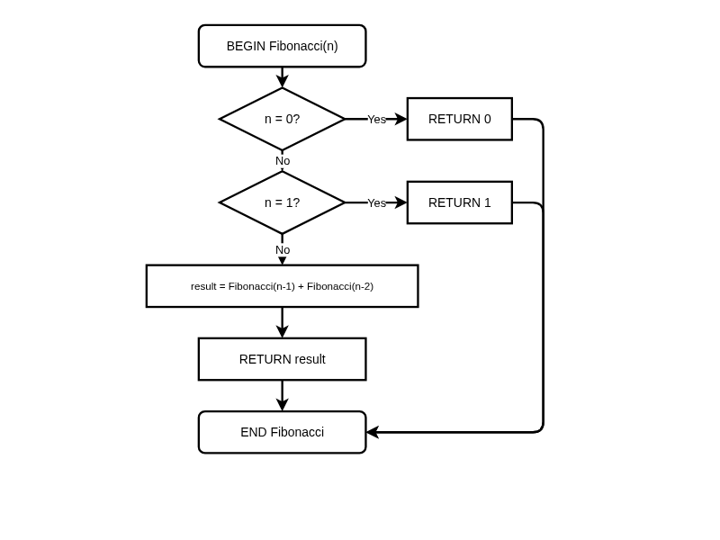
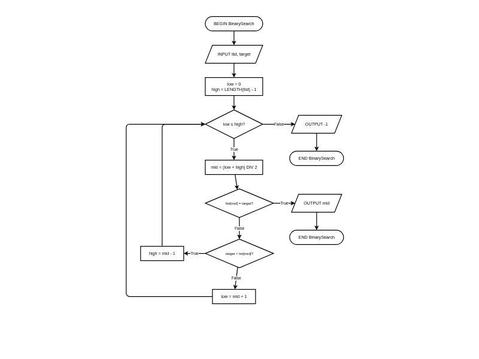
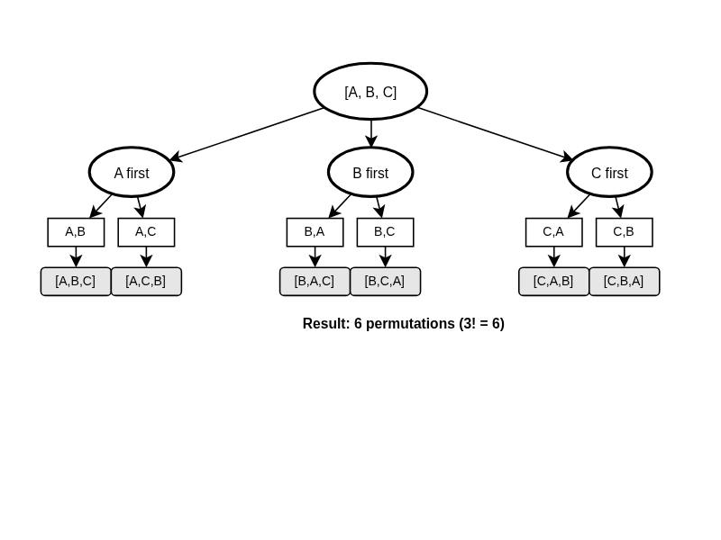
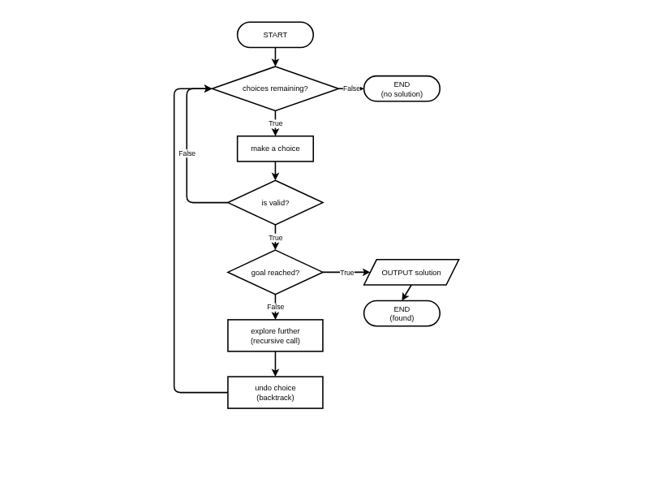

# Advanced Algorithm Patterns

**Description:** Learn recursion, divide and conquer, permutations, and backtracking - powerful techniques for solving complex problems.

**Duration:** 20-30 minutes  
**Learning Mode:** Read explanations, watch videos, complete exercises

---

## Introduction to Advanced Algorithm Patterns

As you progress in algorithm design, you'll encounter problems that require more sophisticated thinking patterns. This lesson introduces four powerful techniques that form the foundation of many complex algorithms:

1. **Recursion** - Subprograms that call themselves
2. **Divide and Conquer** - Breaking problems into smaller pieces
3. **Permutations** - Generating all possible arrangements
4. **Backtracking** - Systematic trial and error with pruning

## Understanding the Fibonacci Sequence First

Before we dive into recursion, let's understand the **Fibonacci sequence** - a famous number pattern we'll use as our first example.

### What is the Fibonacci Sequence?

The **Fibonacci sequence** starts with 0 and 1, then each number is the sum of the two numbers before it.

| Position | Value | How it's calculated |
|----------|-------|---------------------|
| 0 | 0 | (starting value) |
| 1 | 1 | (starting value) |
| 2 | 1 | 0 + 1 = 1 |
| 3 | 2 | 1 + 1 = 2 |
| 4 | 3 | 1 + 2 = 3 |
| 5 | 5 | 2 + 3 = 5 |
| 6 | 8 | 3 + 5 = 8 |
| 7 | 13 | 5 + 8 = 13 |

The sequence: **0, 1, 1, 2, 3, 5, 8, 13, 21, 34, 55, 89, ...**

### Why is the Fibonacci Sequence Important?

- **Nature**: Appears in flower petals, spiral shells, and tree branching
- **Art & Architecture**: The 'Golden Ratio' comes from Fibonacci numbers
- **Computer Science**: Perfect example for learning recursion

## Pattern 1: Recursion

**Recursion** occurs when a subprogram calls itself. Every recursive algorithm needs:

1. **Base Case**: When to stop (prevents infinite recursion)
2. **Recursive Case**: How to break the problem into a smaller version

### Fibonacci Using Recursion

Notice the pattern: to find Fibonacci(6), we need Fibonacci(5) + Fibonacci(4). This means:

- **Fib(n) = Fib(n-1) + Fib(n-2)** (recursive case)
- **Fib(0) = 0** (base case)
- **Fib(1) = 1** (base case)

This self-referential definition is perfect for recursion!

## 📊 Fibonacci Recursive Algorithm Flowchart

_Fibonacci recursive algorithm - the subprogram calls itself twice with smaller values until reaching the base cases_




### Fibonacci in Pseudocode

```
BEGIN Fibonacci(n)
    IF n = 0 THEN
        RETURN 0
    ENDIF
    IF n = 1 THEN
        RETURN 1
    ENDIF
    RETURN Fibonacci(n - 1) + Fibonacci(n - 2)  // This is RECURSION - the function calls itself!
END Fibonacci
```

### How Recursion Works - Tracing Fibonacci(4)

```
Fibonacci(4)
├── Fibonacci(3) + Fibonacci(2)
│   ├── Fibonacci(3)
│   │   ├── Fibonacci(2) + Fibonacci(1)
│   │   │   ├── Fibonacci(2) → Fib(1) + Fib(0) = 1 + 0 = 1
│   │   │   └── Fibonacci(1) → returns 1
│   │   └── returns 1 + 1 = 2
│   └── Fibonacci(2)
│       └── Fib(1) + Fib(0) = 1 + 0 = 1
└── returns 2 + 1 = 3
```

**Result: Fibonacci(4) = 3** ✓ (matches our table: 0, 1, 1, 2, **3**)

### 📖 Step-by-Step Trace: Fibonacci(5)

To truly understand how recursion works, **read through this trace slowly, one step at a time**. Follow each call as it breaks down into smaller calls, hits a base case, and returns a value back up the chain.

---

**Call:** `Fibonacci(5)`
Not a base case → returns `Fibonacci(4) + Fibonacci(3)`

---

**Computing Fibonacci(4):**

`Fibonacci(4)` → `Fibonacci(3) + Fibonacci(2)`

---

**Computing Fibonacci(3) (left branch of Fib(4)):**

`Fibonacci(3)` → `Fibonacci(2) + Fibonacci(1)`

---

**Computing Fibonacci(2) (left branch of Fib(3)):**

`Fibonacci(2)` → `Fibonacci(1) + Fibonacci(0)`

- `Fibonacci(1)` → **1** (base case)
- `Fibonacci(0)` → **0** (base case)
- So `Fibonacci(2) = 1 + 0 = 1`

---

**Back to Fibonacci(3):**

- `Fibonacci(2) = 1` (just calculated)
- `Fibonacci(1) = 1` (base case)
- So `Fibonacci(3) = 1 + 1 = 2`

---

**Computing Fibonacci(2) (right branch of Fib(4)):**

- `Fibonacci(2) = 1` (same as before: 1 + 0)

---

**Back to Fibonacci(4):**

- `Fibonacci(3) = 2`
- `Fibonacci(2) = 1`
- So `Fibonacci(4) = 2 + 1 = 3`

---

**Computing Fibonacci(3) (right branch of Fib(5)):**

`Fibonacci(3)` → `Fibonacci(2) + Fibonacci(1)`

- `Fibonacci(2) = 1`
- `Fibonacci(1) = 1`
- So `Fibonacci(3) = 2`

---

**Back to Fibonacci(5):**

- `Fibonacci(4) = 3`
- `Fibonacci(3) = 2`

**✅ Final result: Fibonacci(5) = 3 + 2 = 5**

> **Notice** how `Fibonacci(2)` and `Fibonacci(3)` are calculated multiple times! This repeated work is why naive recursion can be slow for large values.

## ✍️ Practice: Recursive Sum

Write a recursive subprogram called `SumToN` that calculates the sum of all numbers from 1 to n.

For example:
- SumToN(1) returns 1
- SumToN(3) returns 1 + 2 + 3 = 6
- SumToN(5) returns 1 + 2 + 3 + 4 + 5 = 15

**Hints:**
- Base case: What is SumToN(1)?
- Recursive case: SumToN(n) = n + SumToN(n-1)

**Starter Code:**
```
BEGIN SumToN(n)
    ' Your code here
    
END SumToN
```


```python
# Write your pseudocode here as Python comments
# Remember to use proper indentation and HSC conventions

"""
BEGIN SumToN(n)
    ' Your code here
    
END SumToN
"""

```

<details>
<summary><b>Example Answer</b></summary>

```
# Example solution
BEGIN SumToN(n)
    IF n = 1 THEN
        RETURN 1
    ENDIF
    RETURN n + SumToN(n - 1)
END SumToN
```

</details>

## Pattern 2: Divide and Conquer

**Divide and Conquer** is a strategy that:

1. **Divides** the problem into smaller subproblems
2. **Conquers** each subproblem (often recursively)
3. **Combines** the results

### Classic Example: Binary Search

Binary search finds a target in a **sorted** list by repeatedly halving the search area:

1. Start with the full list (low = 0, high = last index)
2. Check the middle element
3. If it matches the target → done!
4. If target is smaller → search the left half (high = mid - 1)
5. If target is larger → search the right half (low = mid + 1)
6. Repeat until found or no elements left

## 📊 Binary Search Algorithm Flowchart

_Binary search divides the search space in half with each comparison_




### Binary Search in Pseudocode

```
BEGIN BinarySearch(list, target)
    low = 0
    high = LENGTH(list) - 1
    
    WHILE low ≤ high
        mid = (low + high) DIV 2
        
        IF list[mid] = target THEN
            RETURN mid
        ELSEIF target < list[mid] THEN
            high = mid - 1
        ELSE
            low = mid + 1
        ENDIF
    ENDWHILE
    
    RETURN -1
END BinarySearch
```

### Why Binary Search is Efficient

Each comparison eliminates **half** the remaining elements:

- Linear search: O(n) - check every element
- Binary search: O(log n) - dramatically faster for large lists

| List Size | Linear Search (worst) | Binary Search (worst) |
|-----------|----------------------|----------------------|
| 100 | 100 comparisons | 7 comparisons |
| 1,000 | 1,000 comparisons | 10 comparisons |
| 1,000,000 | 1,000,000 comparisons | 20 comparisons |

### 📖 Step-by-Step Trace: Binary Search

To understand how binary search narrows down the search space, **read through this trace one iteration at a time**. Watch how the `low` and `high` boundaries move to cut the search area in half.

---

**Input:**

- List: `[2, 5, 7, 12, 19, 23, 31]`
- Target: `19`

**Initial setup:**

- `low = 0` (start of the list)
- `high = 6` (end of the list — 7 items, last index is 6)

---

**Iteration 1:**

`mid = (0 + 6) DIV 2 = 3`

`list[3] = 12`

We check the middle item. It is **12**. The target is **19**, which is **greater than 12**. So the target cannot be on the left side.

✅ Move the low boundary up: `low = mid + 1 = 4`

Now we only search the right half.

---

**Iteration 2:**

Search range is now indexes 4 to 6.

`mid = (4 + 6) DIV 2 = 5`

`list[5] = 23`

The middle item is **23**. The target is **19**, which is **less than 23**. So the target must be on the left side of this middle.

✅ Move the high boundary down: `high = mid - 1 = 4`

Now we search only index 4.

---

**Iteration 3:**

Search range is 4 to 4 (just one item left).

`mid = (4 + 4) DIV 2 = 4`

`list[4] = 19`

The middle item is **19**, which is exactly the target!

**✅ FOUND → return index 4**

---

**Final Result:** `BinarySearch([2, 5, 7, 12, 19, 23, 31], 19) = 4`

Binary search found the target in only **3 comparisons** instead of checking all 7 elements!

## ✍️ Practice: Find Maximum in Array

Write a recursive divide and conquer subprogram called `FindMax` that finds the maximum value in an array.

Strategy:
1. If the array has one element, return it (base case)
2. Otherwise, divide the array in half
3. Find the maximum of each half recursively
4. Return the larger of the two maximums

**Hint:** Use low and high indices to define the range being searched.

**Starter Code:**
```
BEGIN FindMax(list, low, high)
    ' Your code here
    
END FindMax
```


```python
# Write your pseudocode here as Python comments
# Remember to use proper indentation and HSC conventions

"""
BEGIN FindMax(list, low, high)
    ' Your code here
    
END FindMax
"""

```

<details>
<summary><b>Example Answer</b></summary>

```
# Example solution
BEGIN FindMax(list, low, high)
    IF low = high THEN
        RETURN list[low]
    ENDIF
    
    mid = (low + high) DIV 2
    leftMax = FindMax(list, low, mid)
    rightMax = FindMax(list, mid + 1, high)
    
    IF leftMax > rightMax THEN
        RETURN leftMax
    ELSE
        RETURN rightMax
    ENDIF
END FindMax
```

</details>

## Pattern 3: Permutations

A **permutation** is an arrangement where **order matters**. For example, the permutations of [A, B, C] are:

```
[A, B, C], [A, C, B], [B, A, C], [B, C, A], [C, A, B], [C, B, A]
```

There are n! (n factorial) permutations of n items. So 3 items = 3! = 6 permutations.

### Generating Permutations Recursively

The idea:

1. For each element, put it first
2. Recursively generate all permutations of the remaining elements
3. Combine the first element with each permutation of the rest

## 📊 Permutation Tree for [A, B, C]

_Each branch shows the choice made at each level - 3 items produce 3! = 6 permutations_




### Permutations in Pseudocode

```
BEGIN Permute(items, current)
    IF LENGTH(items) = 0 THEN
        Display current
        RETURN
    ENDIF
    
    FOR i = 0 TO LENGTH(items) - 1
        newCurrent = current + [items[i]]
        remaining = items without items[i]
        Permute(remaining, newCurrent)
    NEXT i
END Permute

' To generate all permutations:
' Permute(["A", "B", "C"], [])
```

### Understanding the Algorithm

1. **Base case**: When no items remain, we have a complete permutation - display it
2. **Recursive case**: For each item, add it to current and permute the rest
3. The recursion naturally explores all possible orderings

### 📖 Step-by-Step Trace: Permute([A, B, C], [])

To understand how permutations are generated recursively, **read through each step carefully**. Watch how the algorithm picks one item at a time, recurses with the remaining items, and backtracks to try different choices.

---

**Call:** `Permute([A, B, C], [])`
Nothing chosen yet. We need to pick one item to start with.

---

**1. Pick A first:**
`current = [A]`, remaining = `[B, C]`
Call: `Permute([B, C], [A])`

**Inside Permute([B, C], [A]) — pick B next:**
`current = [A, B]`, remaining = `[C]`
Call: `Permute([C], [A, B])`

**Inside Permute([C], [A, B]) — pick C:**
`current = [A, B, C]`, remaining = `[]`
Items is empty → this is a complete permutation!
**✅ Display: [A, B, C]**

**Backtrack to Permute([B, C], [A]) — pick C next instead:**
`current = [A, C]`, remaining = `[B]`
Call: `Permute([B], [A, C])`
Only B is left → `current = [A, C, B]`, remaining = `[]`
**✅ Display: [A, C, B]**

---

**2. Pick B first:**
Back to the start, try a different first choice.
`current = [B]`, remaining = `[A, C]`
Call: `Permute([A, C], [B])`

**Inside Permute([A, C], [B]) — pick A next:**
`current = [B, A, C]`, remaining = `[]`
**✅ Display: [B, A, C]**

**Backtrack — pick C next instead:**
`current = [B, C, A]`, remaining = `[]`
**✅ Display: [B, C, A]**

---

**3. Pick C first:**
Back to the start, choose C first.
`current = [C]`, remaining = `[A, B]`
Call: `Permute([A, B], [C])`

**Inside Permute([A, B], [C]) — pick A next:**
`current = [C, A, B]`, remaining = `[]`
**✅ Display: [C, A, B]**

**Backtrack — pick B next instead:**
`current = [C, B, A]`, remaining = `[]`
**✅ Display: [C, B, A]**

---

**All 6 permutations (3! = 6):**

```
[A, B, C]
[A, C, B]
[B, A, C]
[B, C, A]
[C, A, B]
[C, B, A]
```

> **Key insight:** At each level of recursion, we try every remaining item as the next choice. When we run out of items, we have a complete permutation. The algorithm automatically explores all possibilities through recursion and backtracking.

## ✍️ Practice: Count Permutations

Write a subprogram called `CountPermutations` that counts how many permutations exist for n items.

Recall that the number of permutations is n! (n factorial).

**Hint:** Use your knowledge of factorial from earlier in this lesson!

**Starter Code:**
```
BEGIN CountPermutations(n)
    ' Your code here
    
END CountPermutations
```


```python
# Write your pseudocode here as Python comments
# Remember to use proper indentation and HSC conventions

"""
BEGIN CountPermutations(n)
    ' Your code here
    
END CountPermutations
"""

```

<details>
<summary><b>Example Answer</b></summary>

```
# Example solution
BEGIN CountPermutations(n)
    IF n ≤ 1 THEN
        RETURN 1
    ENDIF
    RETURN n × CountPermutations(n - 1)
END CountPermutations
```

</details>

## Pattern 4: Backtracking

**Backtracking** is a technique for solving constraint satisfaction problems by:

1. Building a solution incrementally
2. Abandoning a path as soon as it violates constraints ("pruning")
3. Going back to try other options

### Classic Example: N-Queens Problem

Place N queens on an N×N chessboard so no two queens attack each other.

```
. Q . .     Queens cannot attack each other:
. . . Q     - Not in same row
Q . . .     - Not in same column  
. . Q .     - Not in same diagonal
```

## 📊 Backtracking Process Flowchart

_Backtracking: Try choices, validate, recurse if valid, backtrack (undo) when stuck, loop back to check more choices on the LEFT side — NESA HSC standard_




### Backtracking in Pseudocode

```
BEGIN Solve(state)
    IF IsSolutionComplete(state) THEN
        RETURN True
    ENDIF
    
    FOR each possible choice
        IF IsValidChoice(choice, state) THEN
            MakeChoice(choice, state)
            
            IF Solve(state) = True THEN
                RETURN True
            ENDIF
            
            UndoChoice(choice, state)  ' BACKTRACK
        ENDIF
    NEXT
    
    RETURN False
END Solve
```

### Key Components of Backtracking

1. **State**: The current partial solution
2. **Choices**: What options are available at each step
3. **Constraints**: Rules that valid solutions must follow
4. **Goal test**: How to know when we have a complete solution
5. **Backtrack**: Undo the last choice and try the next option

## ✍️ Practice: Subset Sum with Backtracking

Write a subprogram called `FindSubsetSum` that determines if any subset of numbers adds up to a target sum.

For example:
- FindSubsetSum([3, 7, 2, 8], 10) returns True (3 + 7 = 10 or 2 + 8 = 10)
- FindSubsetSum([1, 2, 3], 7) returns False (no subset adds to 7)

Use backtracking:
1. Try including the current number
2. If that doesn't work, try excluding it (backtrack)
3. Base cases: target = 0 (success) or no more numbers (fail)

**Starter Code:**
```
BEGIN FindSubsetSum(numbers, target, index)
    ' Your code here
    
END FindSubsetSum
```


```python
# Write your pseudocode here as Python comments
# Remember to use proper indentation and HSC conventions

"""
BEGIN FindSubsetSum(numbers, target, index)
    ' Your code here
    
END FindSubsetSum
"""

```

<details>
<summary><b>Example Answer</b></summary>

```
# Example solution
BEGIN FindSubsetSum(numbers, target, index)
    IF target = 0 THEN
        RETURN True
    ENDIF
    
    IF index ≥ LENGTH(numbers) OR target < 0 THEN
        RETURN False
    ENDIF
    
    ' Try including current number
    IF FindSubsetSum(numbers, target - numbers[index], index + 1) THEN
        RETURN True
    ENDIF
    
    ' Backtrack: try excluding current number
    RETURN FindSubsetSum(numbers, target, index + 1)
END FindSubsetSum
```

</details>

## Summary: When to Use Each Pattern

| Pattern | Use When | Example Problems |
|---------|----------|------------------|
| **Recursion** | Problem can be defined in terms of smaller versions of itself | Factorial, Fibonacci, tree traversal |
| **Divide & Conquer** | Problem can be split into independent subproblems | Binary search, merge sort, quick sort |
| **Permutations** | Need to generate all possible arrangements | Anagram finder, scheduling, TSP |
| **Backtracking** | Need to find solutions that satisfy constraints | Sudoku, N-Queens, maze solving |

### Connections Between Patterns

- All these patterns typically use **recursion** as their implementation mechanism
- Permutation generation often uses **backtracking** to explore the solution space
- Divide and conquer can be seen as a **structured form of recursion** with clear divide/combine steps

## Extension: Complexity Analysis

### Time Complexity Summary

| Algorithm | Time Complexity | Space Complexity |
|-----------|----------------|------------------|
| Factorial (recursive) | O(n) | O(n) stack |
| Binary Search | O(log n) | O(1) iterative, O(log n) recursive |
| Generate Permutations | O(n! × n) | O(n) stack |
| Backtracking (worst case) | O(b^d) | O(d) stack |

Where:

- n = input size
- b = branching factor (choices at each step)
- d = depth of recursion

### Why Understanding Complexity Matters

These advanced patterns can be **computationally expensive**. Understanding their complexity helps you:

1. Choose the right algorithm for the problem size
2. Identify when optimisation is needed
3. Predict how long your algorithm will take

## ✅ Lesson Complete!

You've completed this lesson. Make sure you:

- ✓ Watched all videos
- ✓ Read all explanations
- ✓ Completed all exercises
- ✓ Answered all quiz questions

**Ready for the next lesson?** Continue to the next notebook!
